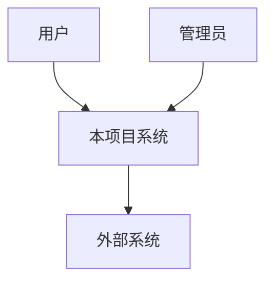
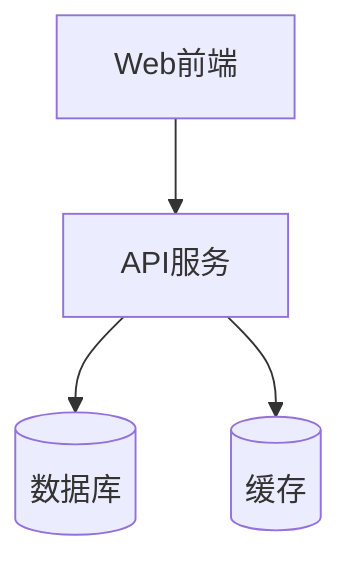
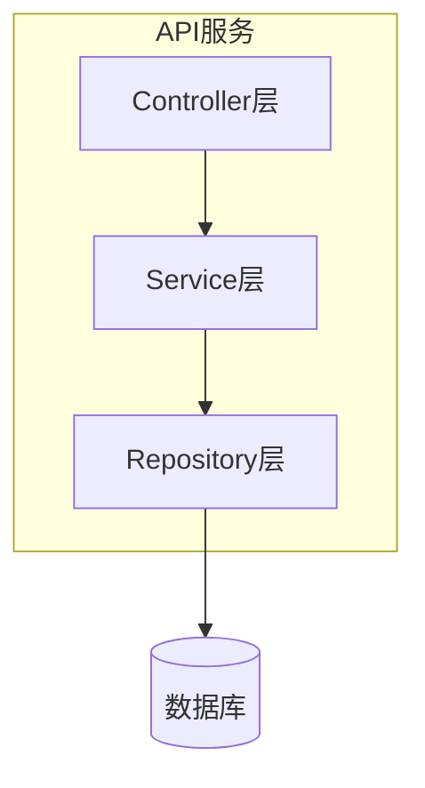

# 架构图

> 项目：{项目名称}
> 日期：{YYYY-MM-DD}

## 1. 系统上下文图

```mermaid
graph TB
    System[本项目系统]
    User[用户]
    Admin[管理员]
    External[外部系统]

    User --> System
    Admin --> System
    System --> External
```

## 2. 容器图

```mermaid
graph TB
    Web[Web前端]
    API[API服务]
    DB[(数据库)]
    Cache[(缓存)]

    Web --> API
    API --> DB
    API --> Cache
```

## 3. 组件图

```mermaid
graph TB
    subgraph API服务
        Controller[Controller层]
        Service[Service层]
        Repository[Repository层]
    end

    Controller --> Service
    Service --> Repository
    Repository --> DB[(数据库)]
```

## 架构说明

{对以上图表的文字说明}
