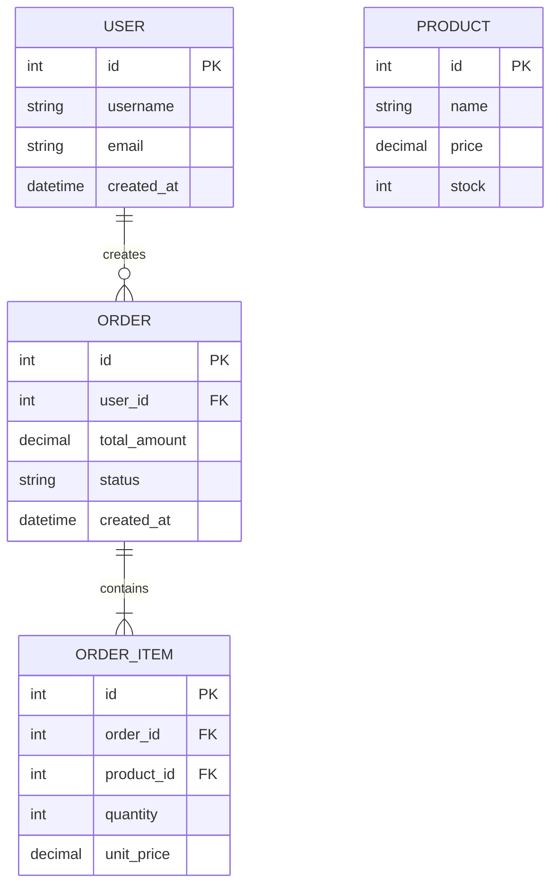

# 数据模型设计

> 项目：{项目名称}
> 日期：{YYYY-MM-DD}

## 1. ER 关系图

## 2. 表结构定义

### 2.1 {表名：users}

| 列名 | 类型 | 约束 | 默认值 | 描述 |
|------|------|------|--------|------|
| id | BIGINT | PK, AUTO_INCREMENT | | 主键 |
| username | VARCHAR(50) | NOT NULL, UNIQUE | | 用户名 |
| email | VARCHAR(100) | NOT NULL, UNIQUE | | 邮箱 |
| password_hash | VARCHAR(255) | NOT NULL | | 密码哈希 |
| created_at | DATETIME | NOT NULL | CURRENT_TIMESTAMP | 创建时间 |
| updated_at | DATETIME | NOT NULL | CURRENT_TIMESTAMP ON UPDATE | 更新时间 |

### 2.2 {表名}

| 列名 | 类型 | 约束 | 默认值 | 描述 |
|------|------|------|--------|------|
| | | | | |

## 3. 索引设计

| 表名 | 索引名 | 列 | 类型 | 用途 |
|------|--------|-----|------|------|
| users | idx_username | username | UNIQUE | 用户名查询 |
| users | idx_email | email | UNIQUE | 邮箱查询 |

## 4. 数据迁移策略

- 初始化脚本：{描述}
- 种子数据：{描述}
- 迁移工具：{描述}
- 回滚策略：{描述}
