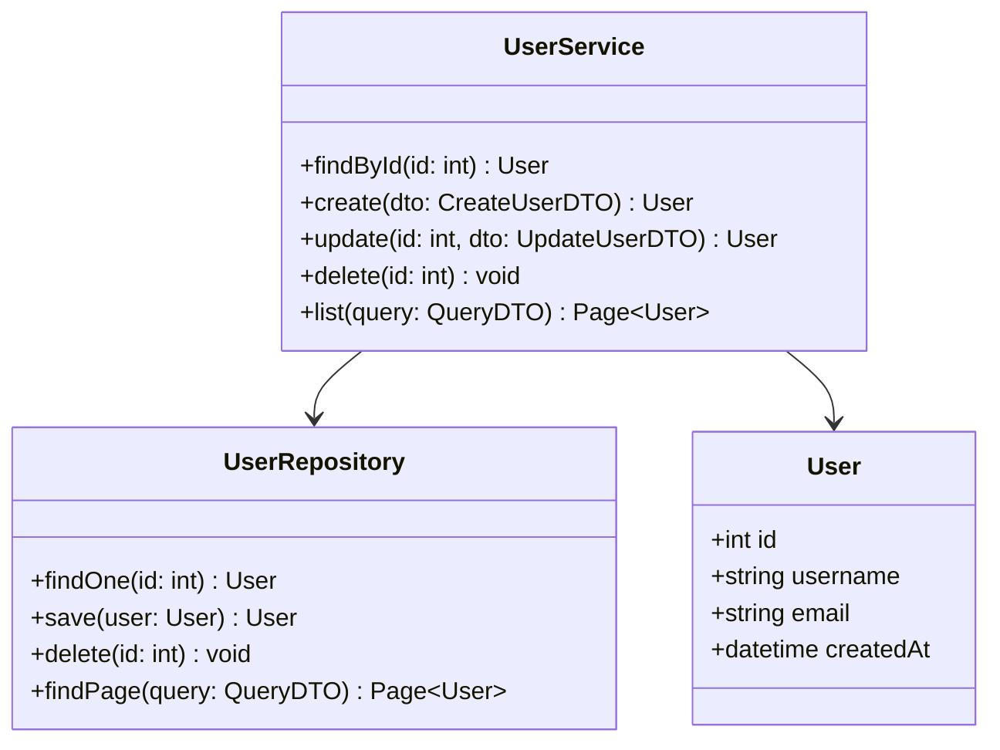
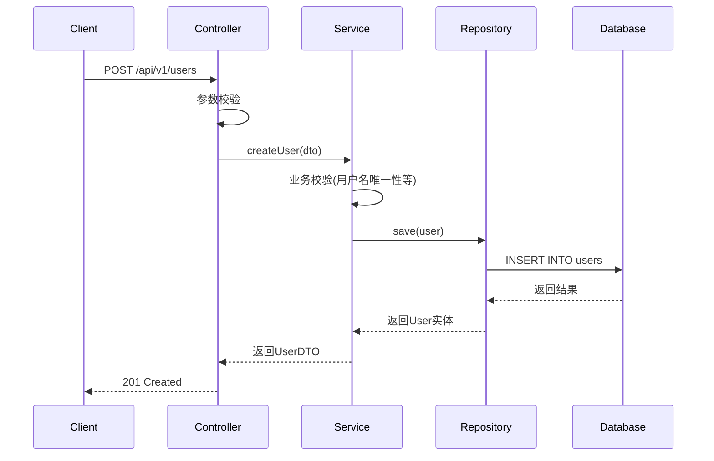
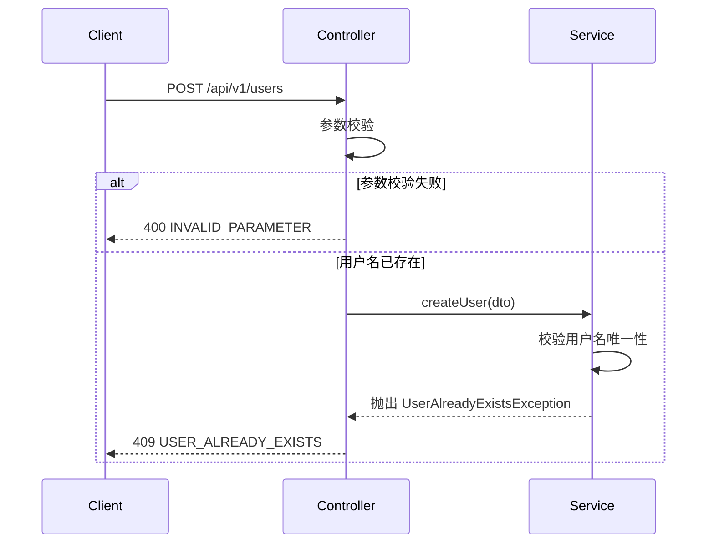
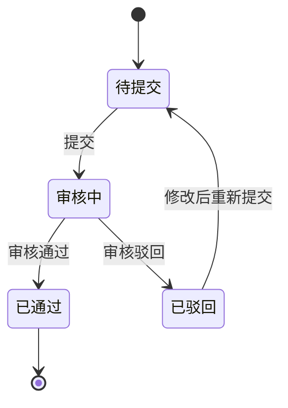

# 详细设计文档

> 项目：{项目名称}
> 日期：{YYYY-MM-DD}

## 1. 模块概述

{描述模块的整体结构和各子模块的职责}

## 2. 类图

## 3. 时序图

### 3.1 {核心流程名称}

### 3.2 {异常流程名称}

## 4. 状态机

## 5. 关键算法

### 5.1 {算法名称}

**输入**：{输入描述}

**输出**：{输出描述}

**算法步骤**：

1. {步骤1}
2. {步骤2}
3. {步骤3}

**复杂度**：{时间复杂度} / {空间复杂度}

## 6. 错误处理策略

| 异常场景 | 错误码 | 处理方式 |
|----------|--------|---------|
| {场景} | {错误码} | {处理方式} |
| {场景} | {错误码} | {处理方式} |

## 7. 变更记录

| 日期 | 变更内容 |
|------|---------|
| {日期} | 初始版本 |
