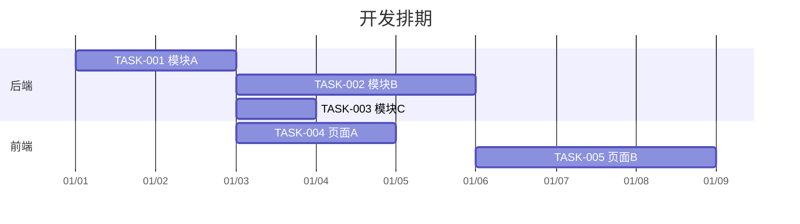

# 任务拆分与排期

> 项目：{项目名称}
> 日期：{YYYY-MM-DD}

## 1. 任务列表

| 任务ID | 任务名称 | 描述 | 负责人 | 预估工时 | 依赖 | 优先级 | 状态 |
|--------|---------|------|--------|---------|------|--------|------|
| TASK-001 | {任务名} | {描述} | {负责人} | 2天 | 无 | P0 | 待开始 |
| TASK-002 | {任务名} | {描述} | {负责人} | 3天 | TASK-001 | P0 | 待开始 |
| TASK-003 | {任务名} | {描述} | {负责人} | 1天 | TASK-001 | P1 | 待开始 |

## 2. 依赖关系图

## 3. 里程碑

| 里程碑 | 包含任务 | 预计完成日期 | 验收标准 |
|--------|---------|-------------|----------|
| M1: 后端核心完成 | TASK-001, TASK-002 | {日期} | API可调通 |
| M2: 前后端联调 | TASK-003, TASK-004 | {日期} | 核心流程走通 |
| M3: 全部完成 | TASK-005 | {日期} | 所有功能可用 |
