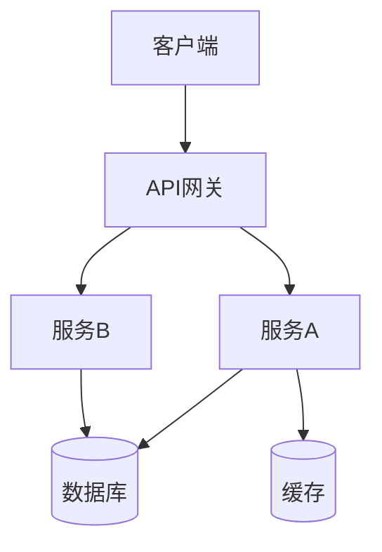
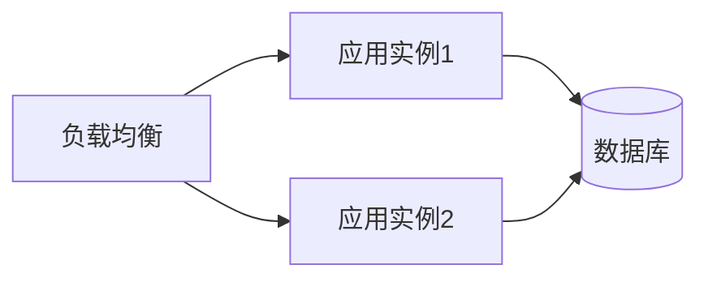

# 技术方案文档

> 项目：{项目名称}
> 版本：1.0
> 日期：{YYYY-MM-DD}
> 作者：{作者}

## 1. 概述

### 1.1 文档目的

{本文档的目的和受众}

### 1.2 项目背景

{简要描述项目背景，引用PRD}

### 1.3 术语和缩写

| 术语 | 定义 |
|------|------|
| | |

## 2. 架构设计

### 2.1 系统架构

### 2.2 架构说明

{对架构图的文字说明，各组件职责}

### 2.3 部署架构

## 3. 技术选型

| 层面 | 选型 | 版本 | 选型理由 | 备选方案 |
|------|------|------|---------|---------|
| 语言 | {选型} | {版本} | {理由} | {备选} |
| 框架 | {选型} | {版本} | {理由} | {备选} |
| ORM | {选型} | {版本} | {理由} | {备选} |
| 数据库 | {选型} | {版本} | {理由} | {备选} |
| 缓存 | {选型} | {版本} | {理由} | {备选} |

## 4. 数据模型设计

{引用独立的数据模型文档，或在此简述}

详见：[数据模型设计]({project}-data-model.md)

## 5. 接口设计

{引用独立的API设计文档，或在此简述}

详见：[API接口设计]({project}-api-design.md)

## 6. 安全设计

### 6.1 认证方案

{认证方式、Token管理、会话策略}

### 6.2 授权方案

{权限模型、角色定义、访问控制策略}

### 6.3 数据安全

{敏感数据识别、加密策略、脱敏规则}

### 6.4 输入安全

{参数校验、SQL注入防护、XSS防护}

### 6.5 通信安全

{HTTPS、CORS、CSRF防护}

## 7. 性能设计

### 7.1 性能目标

| 指标 | 目标值 | 测量方式 |
|------|--------|---------|
| API响应时间(P95) | {目标} | {测量方式} |
| 并发用户数 | {目标} | {测量方式} |
| 数据库查询时间(P95) | {目标} | {测量方式} |

### 7.2 性能策略

- {缓存策略}
- {数据库优化策略}
- {异步处理策略}

## 8. 可观测性设计

### 8.1 日志策略

{日志级别、格式、关键日志点}

### 8.2 监控指标

| 指标 | 告警阈值 | 处理方案 |
|------|---------|---------|
| {指标} | {阈值} | {方案} |

### 8.3 告警规则

{告警级别、通知方式、响应流程}

## 9. 风险与应对

| 风险 | 影响 | 可能性 | 应对方案 |
|------|------|--------|---------|
| {风险描述} | {高/中/低} | {高/中/低} | {应对方案} |

## 10. 变更记录

| 日期 | 版本 | 变更内容 |
|------|------|---------|
| {日期} | 1.0 | 初始版本 |
