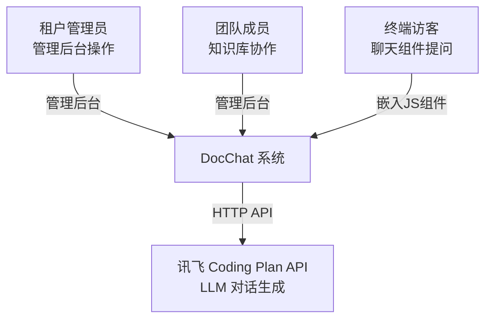
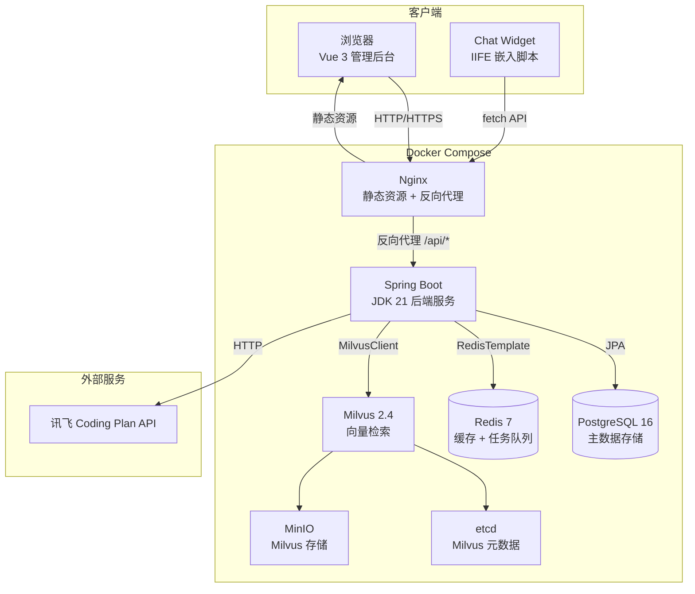
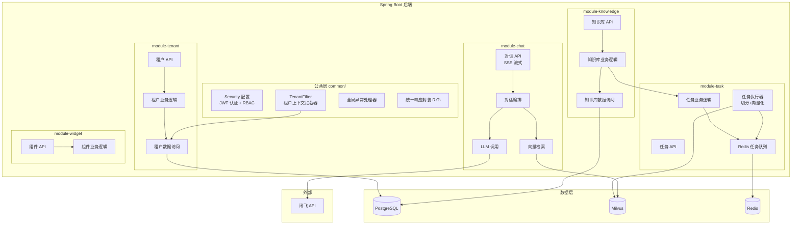
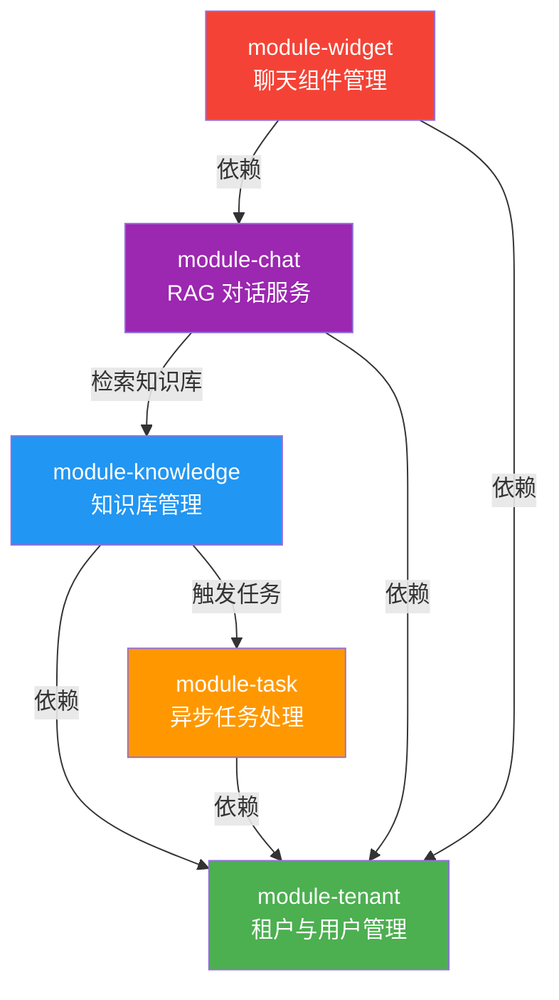
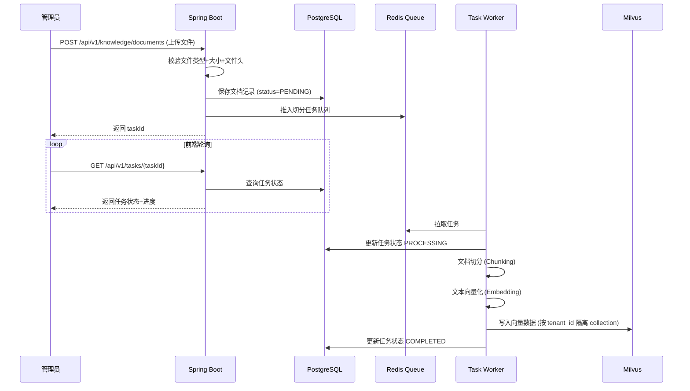
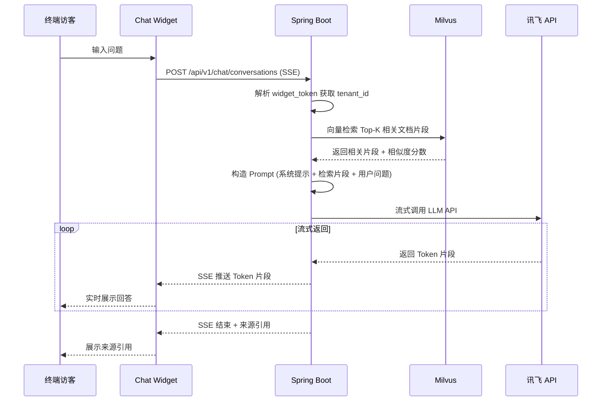

# 架构图

> 项目：DocChat — 文档智能客服 SaaS
> 日期：2026-06-24

## 1. 系统上下文图

## 2. 容器图（Docker Compose 部署）

## 3. 组件图（Spring Boot 内部）

## 4. 模块依赖图

## 5. 请求流程图

### 5.1 文档上传流程

### 5.2 RAG 对话流程

## 架构说明

1. **单体模块化**：MVP 阶段采用 Spring Boot 单体应用，通过包结构划分模块边界，为未来微服务拆分预留空间
2. **异步任务**：文档切分+向量化是 CPU/IO 密集型操作，通过 Redis 队列异步执行，不阻塞上传接口
3. **多租户隔离**：共享数据库 + Hibernate Filter 方案，平衡开发效率和隔离性；Milvus 按租户独立 collection 实现向量数据物理隔离
4. **SSE 流式**：对话接口使用 SSE 流式返回，提升用户体验（首 Token < 1s）
5. **组件嵌入**：Chat Widget 以 IIFE 格式输出，通过 `postMessage` 与宿主页面通信，样式使用 CSS Modules 隔离
