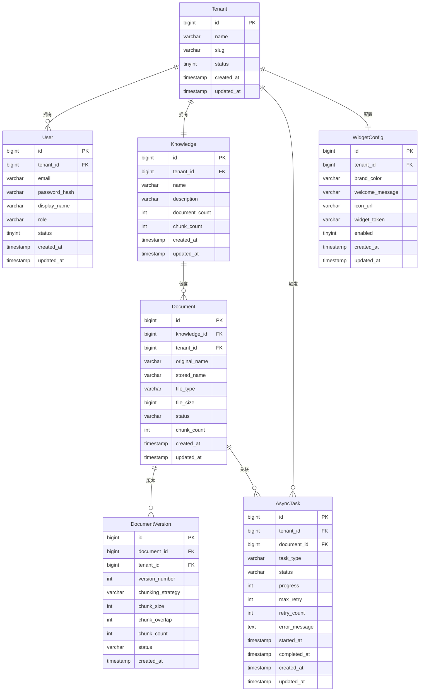

# 数据模型设计

> 项目：DocChat — 文档智能客服 SaaS
> 日期：2026-06-24

## 1. ER 关系图

## 2. 表结构定义

### 2.1 tenants — 租户表

| 列名 | 类型 | 约束 | 默认值 | 描述 |
|------|------|------|--------|------|
| id | BIGINT | PK, AUTO_INCREMENT | | 主键 |
| name | VARCHAR(100) | NOT NULL | | 租户名称 |
| slug | VARCHAR(50) | NOT NULL, UNIQUE | | 租户标识（URL友好） |
| status | SMALLINT | NOT NULL | 1 | 状态：1-正常 0-禁用 |
| created_at | TIMESTAMP | NOT NULL | CURRENT_TIMESTAMP | 创建时间 |
| updated_at | TIMESTAMP | NOT NULL | CURRENT_TIMESTAMP | 更新时间 |

### 2.2 users — 用户表

| 列名 | 类型 | 约束 | 默认值 | 描述 |
|------|------|------|--------|------|
| id | BIGINT | PK, AUTO_INCREMENT | | 主键 |
| tenant_id | BIGINT | NOT NULL, FK → tenants(id) | | 所属租户 |
| email | VARCHAR(100) | NOT NULL | | 邮箱（登录账号） |
| password_hash | VARCHAR(255) | NOT NULL | | BCrypt 密码哈希 |
| display_name | VARCHAR(50) | | | 显示名称 |
| role | VARCHAR(20) | NOT NULL | 'MEMBER' | 角色：ADMIN/MEMBER/READONLY |
| status | SMALLINT | NOT NULL | 1 | 状态：1-正常 0-禁用 |
| created_at | TIMESTAMP | NOT NULL | CURRENT_TIMESTAMP | 创建时间 |
| updated_at | TIMESTAMP | NOT NULL | CURRENT_TIMESTAMP | 更新时间 |

### 2.3 knowledge_bases — 知识库表

| 列名 | 类型 | 约束 | 默认值 | 描述 |
|------|------|------|--------|------|
| id | BIGINT | PK, AUTO_INCREMENT | | 主键 |
| tenant_id | BIGINT | NOT NULL, FK → tenants(id), UNIQUE | | 所属租户（MVP一租户一知识库） |
| name | VARCHAR(100) | NOT NULL | | 知识库名称 |
| description | TEXT | | | 知识库描述 |
| document_count | INT | NOT NULL | 0 | 文档数量（冗余计数） |
| chunk_count | INT | NOT NULL | 0 | 切片段落数（冗余计数） |
| created_at | TIMESTAMP | NOT NULL | CURRENT_TIMESTAMP | 创建时间 |
| updated_at | TIMESTAMP | NOT NULL | CURRENT_TIMESTAMP | 更新时间 |

### 2.4 knowledge_documents — 知识库文档表

| 列名 | 类型 | 约束 | 默认值 | 描述 |
|------|------|------|--------|------|
| id | BIGINT | PK, AUTO_INCREMENT | | 主键 |
| knowledge_id | BIGINT | NOT NULL, FK → knowledge_bases(id) | | 所属知识库 |
| tenant_id | BIGINT | NOT NULL, FK → tenants(id) | | 所属租户（冗余，便于隔离查询） |
| original_name | VARCHAR(255) | NOT NULL | | 原始文件名 |
| stored_name | VARCHAR(255) | NOT NULL | | 存储文件名（UUID） |
| file_type | VARCHAR(10) | NOT NULL | | 文件类型：PDF/MD/TXT |
| file_size | BIGINT | NOT NULL | | 文件大小（字节） |
| status | VARCHAR(20) | NOT NULL | 'PENDING' | 状态：PENDING/PROCESSING/COMPLETED/FAILED |
| chunk_count | INT | NOT NULL | 0 | 切分段落数 |
| created_at | TIMESTAMP | NOT NULL | CURRENT_TIMESTAMP | 创建时间 |
| updated_at | TIMESTAMP | NOT NULL | CURRENT_TIMESTAMP | 更新时间 |

### 2.5 document_versions — 文档版本表

| 列名 | 类型 | 约束 | 默认值 | 描述 |
|------|------|------|--------|------|
| id | BIGINT | PK, AUTO_INCREMENT | | 主键 |
| document_id | BIGINT | NOT NULL, FK → knowledge_documents(id) | | 所属文档 |
| tenant_id | BIGINT | NOT NULL, FK → tenants(id) | | 所属租户 |
| version_number | INT | NOT NULL | | 版本号（递增） |
| chunking_strategy | VARCHAR(30) | NOT NULL | 'FIXED_SIZE' | 切分策略：FIXED_SIZE/SENTENCE/PARAGRAPH |
| chunk_size | INT | NOT NULL | 500 | 切分块大小（字符数） |
| chunk_overlap | INT | NOT NULL | 50 | 切分重叠字符数 |
| chunk_count | INT | NOT NULL | 0 | 切分段落数 |
| status | VARCHAR(20) | NOT NULL | 'PENDING' | 状态：PENDING/COMPLETED/FAILED |
| created_at | TIMESTAMP | NOT NULL | CURRENT_TIMESTAMP | 创建时间 |

### 2.6 async_tasks — 异步任务表

| 列名 | 类型 | 约束 | 默认值 | 描述 |
|------|------|------|--------|------|
| id | BIGINT | PK, AUTO_INCREMENT | | 主键 |
| tenant_id | BIGINT | NOT NULL, FK → tenants(id) | | 所属租户 |
| document_id | BIGINT | FK → knowledge_documents(id) | | 关联文档（可为空，未来其他任务类型） |
| task_type | VARCHAR(30) | NOT NULL | | 任务类型：CHUNK_AND_EMBED/DELETE_VECTORS |
| status | VARCHAR(20) | NOT NULL | 'PENDING' | 状态：PENDING/PROCESSING/COMPLETED/FAILED |
| progress | SMALLINT | NOT NULL | 0 | 进度百分比 0-100 |
| max_retry | SMALLINT | NOT NULL | 3 | 最大重试次数 |
| retry_count | SMALLINT | NOT NULL | 0 | 已重试次数 |
| error_message | TEXT | | | 错误信息 |
| started_at | TIMESTAMP | | | 开始执行时间 |
| completed_at | TIMESTAMP | | | 完成时间 |
| created_at | TIMESTAMP | NOT NULL | CURRENT_TIMESTAMP | 创建时间 |
| updated_at | TIMESTAMP | NOT NULL | CURRENT_TIMESTAMP | 更新时间 |

### 2.7 widget_configs — 聊天组件配置表

| 列名 | 类型 | 约束 | 默认值 | 描述 |
|------|------|------|--------|------|
| id | BIGINT | PK, AUTO_INCREMENT | | 主键 |
| tenant_id | BIGINT | NOT NULL, FK → tenants(id), UNIQUE | | 所属租户（一租户一配置） |
| brand_color | VARCHAR(7) | NOT NULL | '#1890ff' | 品牌色（HEX） |
| welcome_message | VARCHAR(200) | NOT NULL | '你好，有什么可以帮你的？' | 欢迎语 |
| icon_url | VARCHAR(500) | | | 图标 URL |
| widget_token | VARCHAR(64) | NOT NULL, UNIQUE | | Widget 鉴权 Token（随机生成） |
| enabled | SMALLINT | NOT NULL | 1 | 是否启用：1-启用 0-禁用 |
| created_at | TIMESTAMP | NOT NULL | CURRENT_TIMESTAMP | 创建时间 |
| updated_at | TIMESTAMP | NOT NULL | CURRENT_TIMESTAMP | 更新时间 |

## 3. 索引设计

| 表名 | 索引名 | 列 | 类型 | 用途 |
|------|--------|-----|------|------|
| tenants | uk_slug | slug | UNIQUE | 租户标识唯一查询 |
| users | uk_tenant_email | (tenant_id, email) | UNIQUE | 租户内邮箱唯一 |
| users | idx_users_tenant_id | tenant_id | NORMAL | 租户维度的用户查询 |
| knowledge_bases | uk_kb_tenant_id | tenant_id | UNIQUE | 租户唯一知识库 |
| knowledge_documents | idx_doc_knowledge_id | knowledge_id | NORMAL | 知识库下的文档查询 |
| knowledge_documents | idx_doc_tenant_id | tenant_id | NORMAL | 租户维度的文档查询 |
| knowledge_documents | idx_doc_status | status | NORMAL | 按状态筛选文档 |
| document_versions | idx_ver_document_id | document_id | NORMAL | 文档的版本查询 |
| async_tasks | idx_task_tenant_id | tenant_id | NORMAL | 租户维度的任务查询 |
| async_tasks | idx_task_document_id | document_id | NORMAL | 文档关联的任务查询 |
| async_tasks | idx_task_status | status | NORMAL | 按状态查询任务 |
| widget_configs | uk_wc_tenant_id | tenant_id | UNIQUE | 租户唯一组件配置 |
| widget_configs | uk_wc_widget_token | widget_token | UNIQUE | Widget Token 查询 |

## 4. Milvus Collection 设计

### 4.1 文档向量 Collection

每个租户一个独立 Collection，命名规则：`docchat_vectors_{tenant_id}`

| 字段名 | 类型 | 描述 |
|--------|------|------|
| chunk_id | VARCHAR(64) | 主键，切分段落 UUID |
| document_id | INT64 | 关联的文档 ID |
| document_name | VARCHAR(255) | 文档原始名称（用于来源引用） |
| chunk_index | INT32 | 段落在文档中的序号 |
| content | VARCHAR(60000) | 段落原文 |
| embedding | FLOAT_VECTOR(1536) | 向量（使用 OpenAI text-embedding-3-small 维度或讯飞对应维度） |

**索引配置**：
- 索引类型：IVF_FLAT
- 度量类型：COSINE
- nlist：1024
- nprobe（查询时）：8

## 5. Redis 数据结构设计

| Key 模式 | 类型 | 用途 | TTL |
|----------|------|------|-----|
| `docchat:task:queue:{task_type}` | LIST | 任务队列（左推右取） | 无 |
| `docchat:task:processing:{task_id}` | HASH | 任务执行状态 | 1h |
| `docchat:auth:login_fail:{email}` | STRING | 登录失败计数 | 30min |
| `docchat:cache:knowledge:{tenant_id}` | STRING | 知识库信息缓存 | 5min |
| `docchat:cache:widget:{widget_token}` | STRING | Widget 配置缓存 | 10min |
| `docchat:lock:task:{task_id}` | STRING | 任务执行分布式锁 | 30min |

## 6. 数据迁移策略

- **迁移工具**：Flyway，Spring Boot 自动执行
- **迁移脚本**：
  - `V1__create_tenant_tables.sql` — 创建 tenants、users 表
  - `V2__create_knowledge_tables.sql` — 创建 knowledge_bases、knowledge_documents、document_versions 表
  - `V3__create_task_tables.sql` — 创建 async_tasks 表
  - `V4__create_widget_tables.sql` — 创建 widget_configs 表
- **种子数据**：开发环境通过 `scripts/seed-data.sh` 注入测试数据
- **回滚策略**：Flyway 不支持回滚已执行脚本，通过新增迁移脚本修复问题

## 7. 变更记录

| 日期 | 变更内容 |
|------|---------|
| 2026-06-24 | 初始版本，定义 7 张业务表 + Milvus Collection + Redis 数据结构 |
