# 详细设计文档

> 项目：DocChat — 文档智能客服 SaaS
> 日期：2026-06-24

## 1. 模块概述

MVP 阶段包含 5 个业务模块 + 1 个公共层，按依赖顺序实现：

| 顺序 | 模块 | 职责 | 依赖 |
|------|------|------|------|
| 1 | common | 全局配置、异常体系、响应封装、租户上下文 | 无 |
| 2 | module-tenant | 注册登录、租户管理、团队成员 | common |
| 3 | module-knowledge | 文档上传/删除、版本管理 | common, module-tenant, module-task |
| 4 | module-task | 异步任务提交/查询/重试、任务执行器 | common, module-tenant |
| 5 | module-chat | RAG 对话、向量检索、LLM 调用 | common, module-tenant, module-knowledge |
| 6 | module-widget | 组件配置、嵌入脚本生成 | common, module-tenant, module-chat |

## 2. 类图

### 2.1 公共层 (common)

```mermaid
classDiagram
    class R~T~ {
        +int code
        +String msg
        +T data
        +ok(data: T) R~T~
        +fail(errorCode: ErrorCode) R~T~
    }

    class PageResult~T~ {
        +List~T~ list
        +long total
        +int page
        +int size
    }

    class BizException {
        +ErrorCode errorCode
        +String detail
    }

    class SystemException {
        +ErrorCode errorCode
        +Throwable cause
    }

    class GlobalExceptionHandler {
        +handleBizException(e: BizException) R
        +handleSystemException(e: SystemException) R
        +handleValidationException(e: MethodArgumentNotValidException) R
    }

    class TenantContext {
        -ThreadLocal~Long~ tenantIdHolder
        +setTenantId(id: Long) void
        +getTenantId() Long
        +clear() void
    }

    class TenantFilter {
        +doFilter(request: HttpServletRequest, chain: FilterChain) void
    }

    class ErrorCode {
        +int code
        +String msg
    }
```

### 2.2 租户模块 (module-tenant)

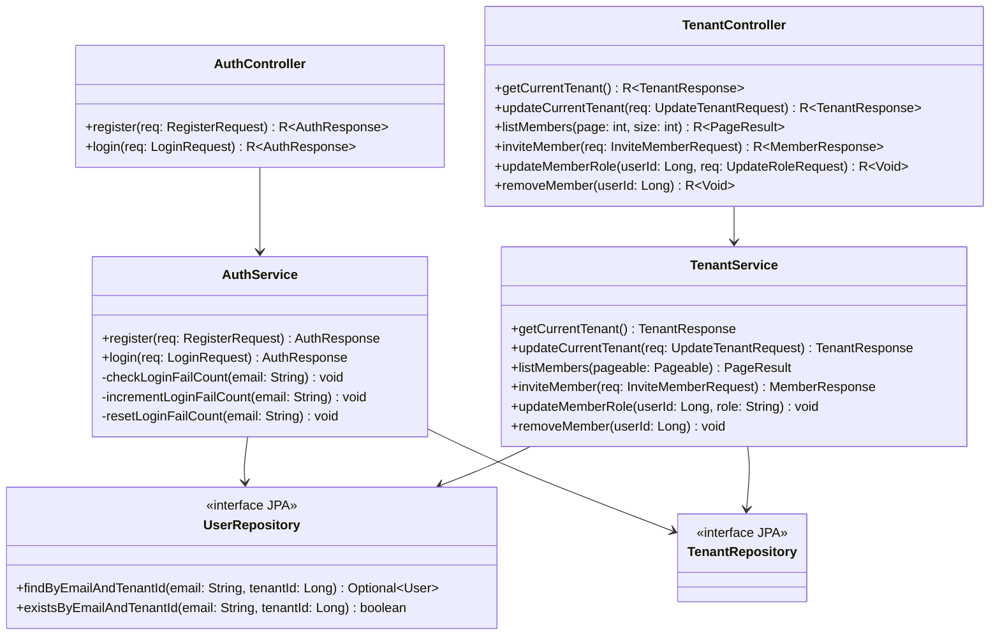

### 2.3 知识库模块 (module-knowledge)

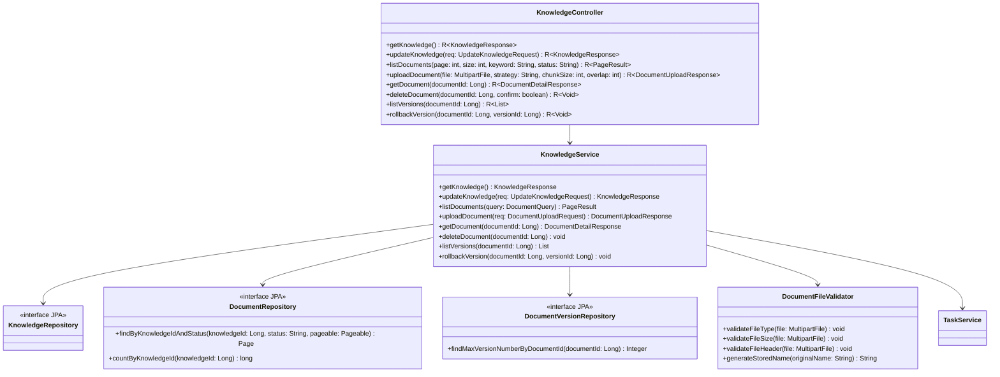

### 2.4 任务模块 (module-task)

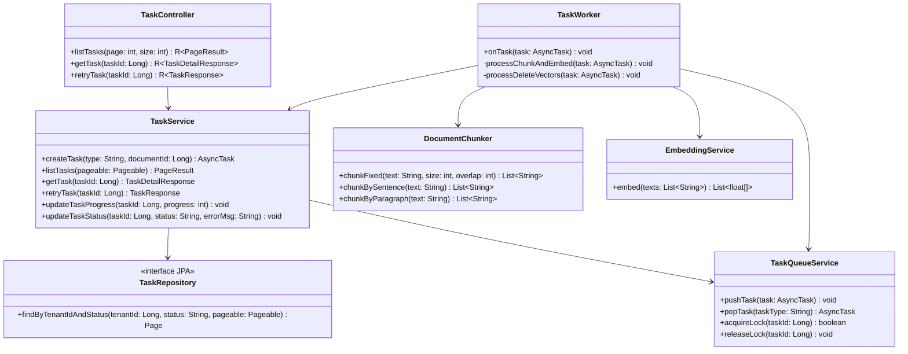

### 2.5 对话模块 (module-chat)

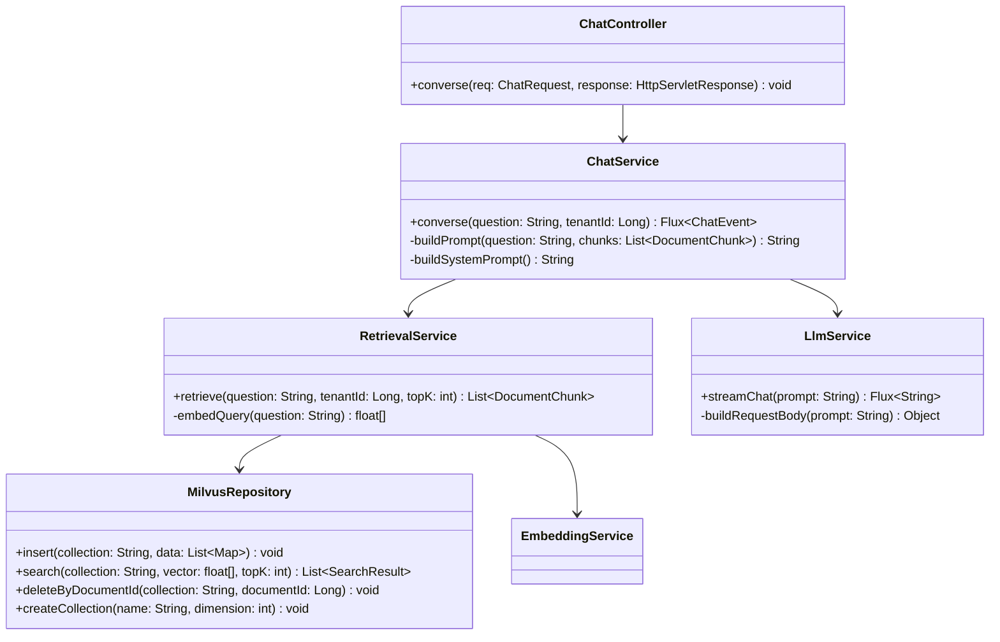

### 2.6 组件模块 (module-widget)

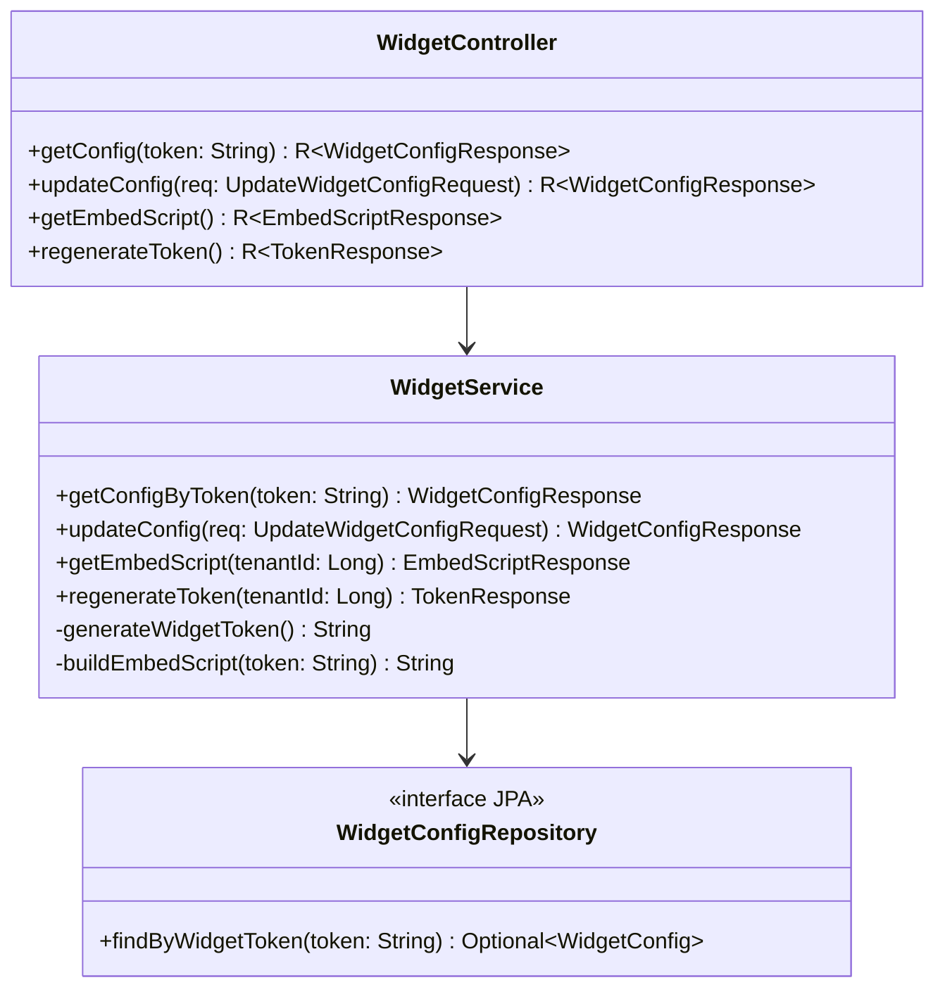

## 3. 时序图

### 3.1 用户注册流程

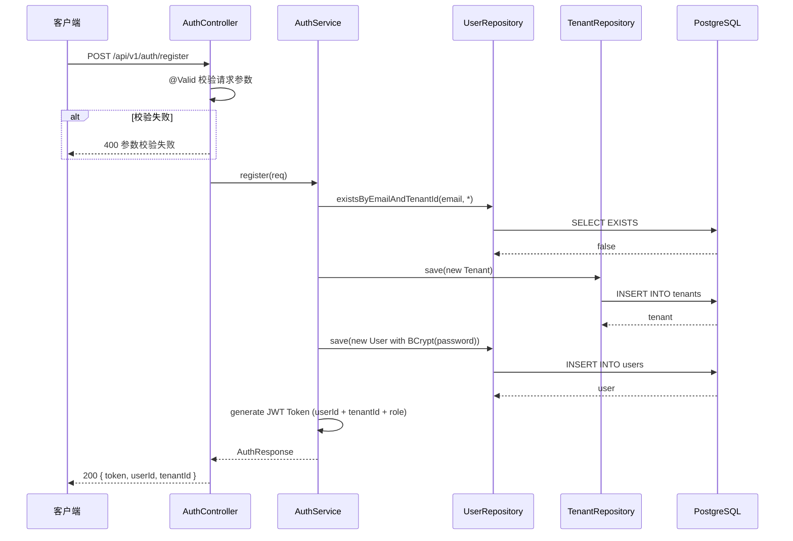

### 3.2 文档上传流程

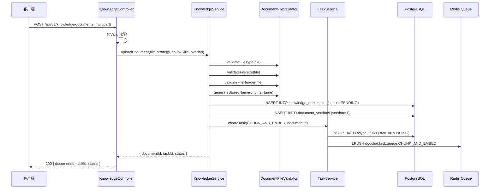

### 3.3 任务执行流程

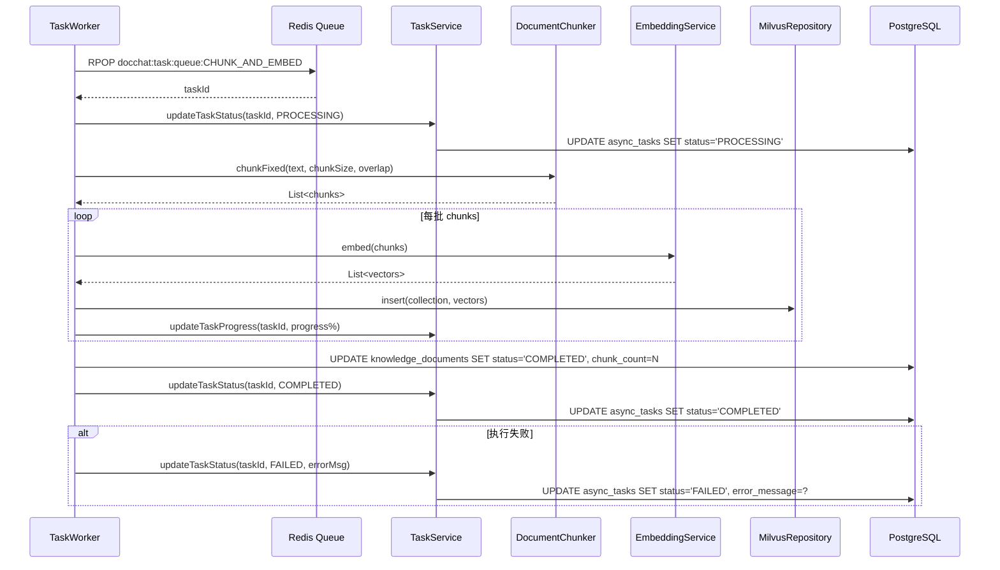

### 3.4 RAG 对话流程

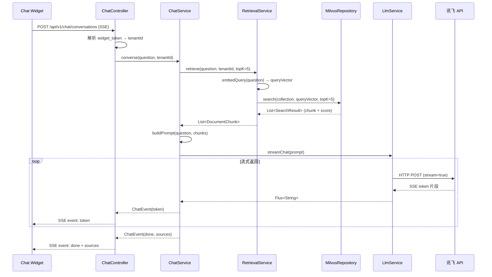

### 3.5 任务重试异常流程

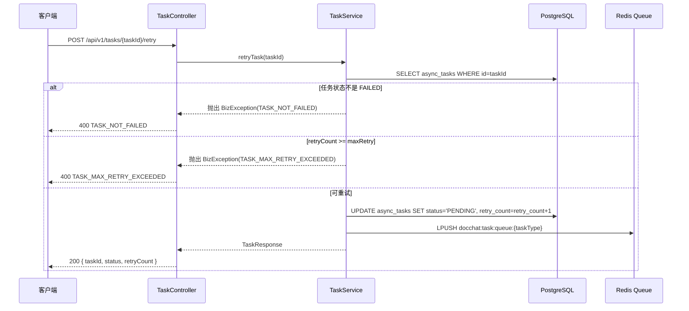

## 4. 状态机

### 4.1 文档处理状态

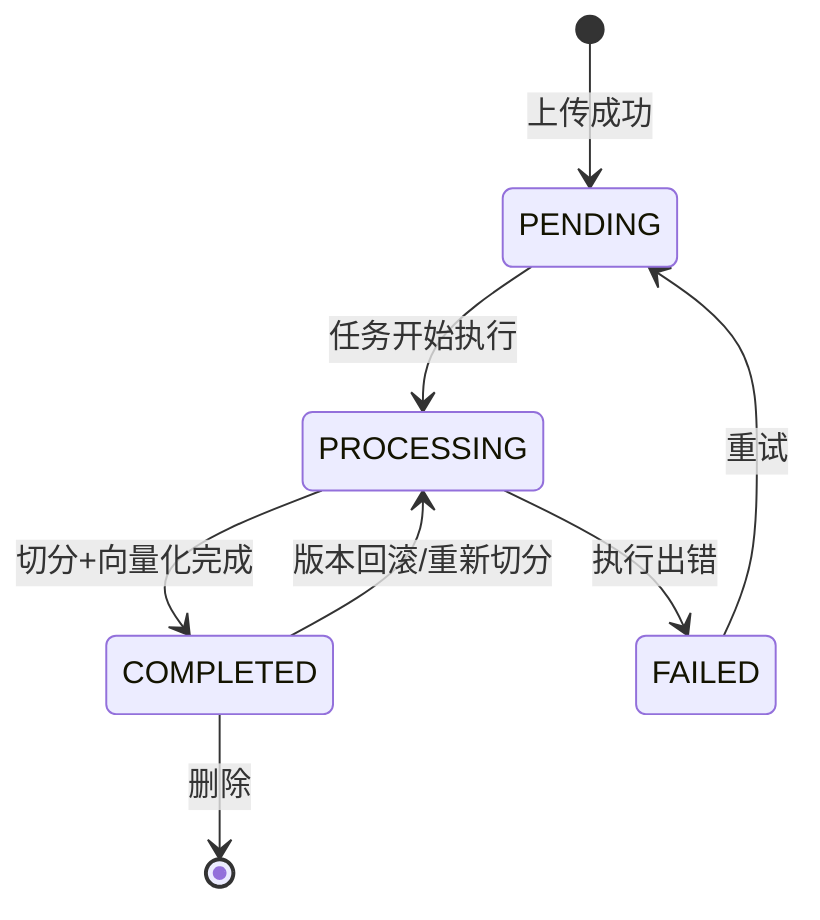

### 4.2 异步任务状态

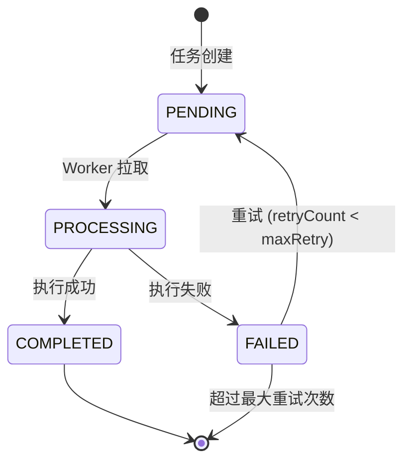

### 4.3 用户角色权限

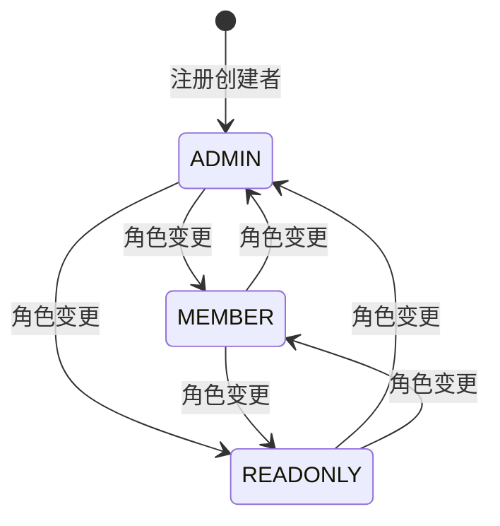

**权限矩阵**：

| 操作 | ADMIN | MEMBER | READONLY |
|------|-------|--------|----------|
| 租户信息管理 | ✅ | ❌ | ❌ |
| 成员管理 | ✅ | ❌ | ❌ |
| 文档上传/删除 | ✅ | ✅ | ❌ |
| 文档查看 | ✅ | ✅ | ✅ |
| 版本回滚 | ✅ | ✅ | ❌ |
| 任务重试 | ✅ | ✅ | ❌ |
| 组件配置 | ✅ | ❌ | ❌ |
| 组件查看 | ✅ | ✅ | ✅ |

## 5. 关键算法

### 5.1 文档固定大小切分算法

**输入**：文档全文 text，切分块大小 chunkSize，重叠字符数 overlap

**输出**：切分段落列表 List\<String\>

**算法步骤**：

1. 将文本按字符读取
2. 从位置 0 开始，取 chunkSize 个字符作为一个 chunk
3. 下一个 chunk 的起始位置 = 当前起始位置 + chunkSize - overlap
4. 重复步骤 2-3 直到文本末尾
5. 最后一个 chunk 如果长度 < chunkSize/2，合并到前一个 chunk
6. 对每个 chunk 做前后空白字符 trim

**复杂度**：O(n) / O(n)，n 为文本长度

### 5.2 Milvus 混合检索算法

**输入**：用户问题 question，租户 ID tenantId，返回数量 topK

**输出**：相关文档片段列表 List\<DocumentChunk\>

**算法步骤**：

1. 调用 EmbeddingService 将 question 转为向量 queryVector
2. 在 Milvus collection `docchat_vectors_{tenantId}` 中执行向量搜索
3. 搜索参数：metric_type=COSINE, params={"nprobe": 8}, limit=topK
4. 返回结果按相似度分数降序排列
5. 过滤相似度分数 < 0.5 的结果（阈值可配置）
6. 将 Milvus 结果映射为 DocumentChunk（含 documentName, chunkIndex, content, score）

**复杂度**：O(n * d) 向量检索，n 为 collection 中向量数，d 为维度

### 5.3 RAG Prompt 构造算法

**输入**：用户问题 question，检索结果 chunks，系统提示 systemPrompt

**输出**：完整 Prompt 字符串

**算法步骤**：

1. 构造系统提示：`你是 DocChat 智能客服，基于以下文档内容回答用户问题。如果文档中没有相关信息，请诚实回答"抱歉，文档中没有相关信息"。`
2. 拼接检索结果：每个 chunk 格式为 `[来源: {documentName} 第{chunkIndex}段]\n{content}\n`
3. 拼接用户问题：`用户问题：{question}`
4. 限制 Prompt 总长度 < 4000 字符（超出则截断较早的 chunk）

**复杂度**：O(k)，k 为检索返回的 chunk 数量

## 6. 错误处理策略

| 异常场景 | 错误码 | 处理方式 |
|----------|--------|---------|
| 邮箱已注册 | AUTH_EMAIL_EXISTS | 返回 409，提示邮箱已注册 |
| 登录失败 | AUTH_LOGIN_FAILED | 返回 401，累计失败次数 |
| 账户锁定 | AUTH_ACCOUNT_LOCKED | 返回 423，提示等待时间 |
| 文件类型不支持 | KNOWLEDGE_FILE_TYPE_NOT_ALLOWED | 返回 400，列出支持的类型 |
| 文件过大 | KNOWLEDGE_FILE_TOO_LARGE | 返回 400，提示大小限制 |
| 文件头不匹配 | KNOWLEDGE_FILE_HEADER_MISMATCH | 返回 400，提示文件可能损坏 |
| 文档不存在 | KNOWLEDGE_DOCUMENT_NOT_FOUND | 返回 404 |
| 任务未失败 | TASK_NOT_FAILED | 返回 400，只有失败任务可重试 |
| 超过最大重试 | TASK_MAX_RETRY_EXCEEDED | 返回 400 |
| Widget Token 无效 | WIDGET_TOKEN_INVALID | 返回 401 |
| Widget 已禁用 | CHAT_WIDGET_DISABLED | 返回 403 |
| LLM 服务不可用 | CHAT_LLM_UNAVAILABLE | 返回 503，提示稍后重试 |
| 跨租户访问 | FORBIDDEN | 返回 403，Hibernate Filter 自动拦截 |
| 参数校验失败 | INVALID_PARAMETER | 返回 400，列出校验失败字段 |

## 7. 变更记录

| 日期 | 变更内容 |
|------|---------|
| 2026-06-24 | 初始版本，完成 5 模块类图 + 5 时序图 + 3 状态机 + 3 关键算法 |
