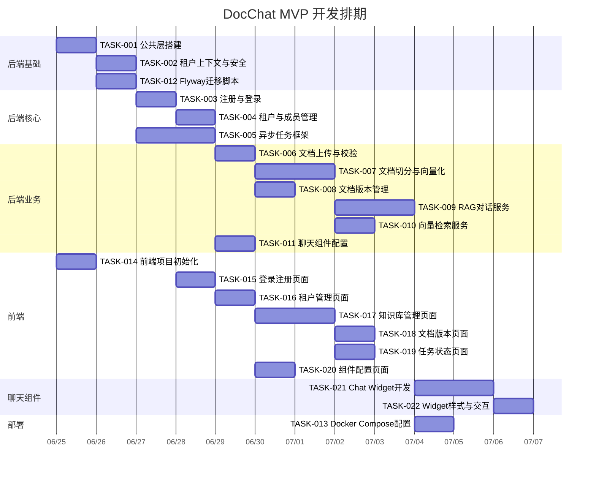

# 任务拆分与排期

> 项目：DocChat — 文档智能客服 SaaS
> 日期：2026-06-24

## 1. 任务列表

### 后端任务

| 任务ID | 任务名称 | 描述 | 预估工时 | 依赖 | 优先级 | 状态 |
|--------|---------|------|---------|------|--------|------|
| TASK-001 | 公共层搭建 | 统一响应R\<T\>、异常体系、全局异常处理器、错误码定义、Flyway配置 | 1天 | 无 | P0 | 待开始 |
| TASK-002 | 租户上下文与安全框架 | TenantContext(ThreadLocal)、TenantFilter、Spring Security配置、JWT工具类、RBAC注解 | 1天 | TASK-001 | P0 | 待开始 |
| TASK-003 | 用户注册与登录 | AuthController/Service、注册逻辑、登录逻辑、登录失败锁定(Redis)、JWT生成与验证 | 1天 | TASK-002 | P0 | 待开始 |
| TASK-004 | 租户与成员管理 | TenantController/Service、租户信息CRUD、成员邀请、角色变更、成员移除 | 1天 | TASK-003 | P0 | 待开始 |
| TASK-005 | 异步任务框架 | TaskService/QueueService/TaskWorker、Redis队列实现、任务状态管理、进度更新、失败重试 | 2天 | TASK-002 | P0 | 待开始 |
| TASK-006 | 文档上传与校验 | KnowledgeController/Service、文件类型/大小/文件头校验、UUID重命名、MultipartFile处理 | 1天 | TASK-004, TASK-005 | P0 | 待开始 |
| TASK-007 | 文档切分与向量化 | DocumentChunker(固定大小/句子/段落切分)、EmbeddingService、Milvus集成、TaskWorker切分逻辑 | 2天 | TASK-005, TASK-006 | P0 | 待开始 |
| TASK-008 | 文档版本管理 | 版本记录、版本列表查询、版本回滚逻辑 | 1天 | TASK-006 | P0 | 待开始 |
| TASK-009 | RAG对话服务 | ChatController/Service、SSE流式响应、Prompt构造、LlmService(讯飞API集成) | 2天 | TASK-007 | P0 | 待开始 |
| TASK-010 | 向量检索服务 | RetrievalService、Milvus搜索、相似度过滤、来源引用构造 | 1天 | TASK-007 | P0 | 待开始 |
| TASK-011 | 聊天组件配置 | WidgetController/Service、配置CRUD、WidgetToken生成与验证、嵌入脚本生成 | 1天 | TASK-004 | P0 | 待开始 |
| TASK-012 | Flyway迁移脚本 | V1~V4 SQL脚本、索引创建、种子数据 | 0.5天 | TASK-001 | P0 | 待开始 |
| TASK-013 | Docker Compose配置 | Dockerfile.server/web、docker-compose.yml、Milvus配置、Nginx配置 | 1天 | TASK-009, TASK-011 | P0 | 待开始 |

### 前端任务

| 任务ID | 任务名称 | 描述 | 预估工时 | 依赖 | 优先级 | 状态 |
|--------|---------|------|---------|------|--------|------|
| TASK-014 | 前端项目初始化 | Vite+Vue3+Ant Design Vue+Pinia+Router+Axios配置、布局组件、路由守卫 | 1天 | 无 | P0 | 待开始 |
| TASK-015 | 登录注册页面 | 登录表单、注册表单、表单校验、Token存储、Axios拦截器 | 1天 | TASK-014, TASK-003 | P0 | 待开始 |
| TASK-016 | 租户管理页面 | 租户信息展示/编辑、成员列表、邀请成员、角色变更、移除成员 | 1天 | TASK-015, TASK-004 | P0 | 待开始 |
| TASK-017 | 知识库管理页面 | 文档列表(分页/搜索/状态筛选)、文档上传(进度条)、文档删除(二次确认) | 1.5天 | TASK-016, TASK-006 | P0 | 待开始 |
| TASK-018 | 文档版本页面 | 版本列表、切分策略展示、版本回滚 | 0.5天 | TASK-017, TASK-008 | P0 | 待开始 |
| TASK-019 | 任务状态页面 | 任务列表、任务详情(进度)、失败任务重试 | 1天 | TASK-017, TASK-005 | P0 | 待开始 |
| TASK-020 | 组件配置页面 | 品牌色/欢迎语/图标配置、实时预览、嵌入脚本复制 | 1天 | TASK-016, TASK-011 | P0 | 待开始 |

### 聊天组件任务

| 任务ID | 任务名称 | 描述 | 预估工时 | 依赖 | 优先级 | 状态 |
|--------|---------|------|---------|------|--------|------|
| TASK-021 | Chat Widget开发 | IIFE构建配置、ChatWidget主类、聊天UI、SSE接收、来源引用展示、CSS隔离 | 2天 | TASK-009 | P0 | 待开始 |
| TASK-022 | Widget样式与交互 | 品牌色应用、欢迎语、图标、打开/关闭动画、响应式适配 | 1天 | TASK-021 | P0 | 待开始 |

## 2. 依赖关系图与排期

## 3. 里程碑

| 里程碑 | 包含任务 | 预计完成日期 | 验收标准 |
|--------|---------|-------------|----------|
| M1: 后端基础完成 | TASK-001, 002, 003, 004, 012 | 2026-06-28 | 注册登录+租户管理API可调通 |
| M2: 后端核心完成 | TASK-005, 006, 007, 008 | 2026-07-02 | 文档上传→切分→向量化全流程跑通 |
| M3: 对话服务完成 | TASK-009, 010, 011 | 2026-07-05 | RAG对话API可调通，返回带引用的回答 |
| M4: 前端完成 | TASK-014~020 | 2026-07-07 | 管理后台核心页面可用 |
| M5: 聊天组件完成 | TASK-021, 022 | 2026-07-09 | Widget可嵌入网页并正常对话 |
| M6: 部署完成 | TASK-013 | 2026-07-10 | Docker Compose 一键启动 |

## 4. 工时汇总

| 类别 | 任务数 | 总工时 | 占比 |
|------|--------|--------|------|
| 后端 | 13 | 14.5天 | 56% |
| 前端 | 7 | 7天 | 27% |
| 聊天组件 | 2 | 3天 | 12% |
| 部署 | 1 | 1天 | 4% |
| **合计** | **23** | **25.5天** | **100%** |

> 注：以上为单人开发工时估算。如前后端并行开发，关键路径约 15 个工作日。

## 5. 变更记录

| 日期 | 变更内容 |
|------|---------|
| 2026-06-24 | 初始版本，23个任务，6个里程碑 |
