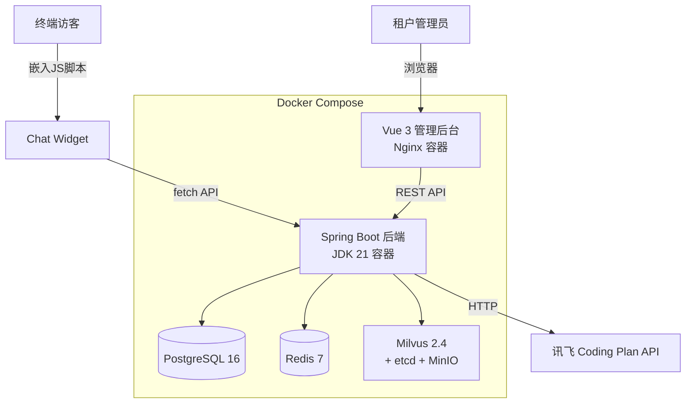

# 技术方案文档

> 项目：DocChat — 文档智能客服 SaaS
> 版本：1.0 (MVP)
> 日期：2026-06-24
> 作者：技术团队

## 1. 概述

### 1.1 文档目的

本文档定义 DocChat MVP 阶段的技术方案，包括架构设计、技术选型、安全设计、性能设计等。面向开发团队，作为编码实现的依据。

### 1.2 项目背景

详见 [DocChat PRD](docchat-prd.md)。DocChat 是面向独立开发者/小团队的文档智能客服 SaaS，MVP 阶段需交付：租户管理、知识库管理、异步任务处理、RAG 对话服务、聊天组件嵌入 5 大模块。

### 1.3 术语和缩写

| 术语 | 定义 |
|------|------|
| JPA | Java Persistence API，Java 持久化标准 |
| Milvus | 开源向量数据库，用于 RAG 检索 |
| IIFE | Immediately Invoked Function Expression，立即执行函数表达式 |
| TenantContext | 基于 ThreadLocal 的租户上下文，存储当前请求的租户 ID |

## 2. 架构设计

### 2.1 系统架构

详见 [架构图](docchat-architecture.md)

**核心架构决策**：
- **单体应用**：MVP 阶段采用 Spring Boot 单体应用，模块化分包，不做微服务拆分
- **模块化设计**：按业务域划分模块（module-tenant / module-knowledge / module-task / module-chat / module-widget），模块间通过 Service 层调用
- **异步任务**：基于 Redis 自建轻量队列，避免引入 RabbitMQ/Kafka 等重量级中间件
- **多租户隔离**：共享数据库 + Hibernate Filter 自动注入 tenant_id，Milvus 按租户独立 collection

### 2.2 部署架构



### 2.3 请求流转

```
终端访客提问 → Chat Widget (IIFE) → /api/v1/chat/conversations (POST)
→ ChatController → ChatService → RetrievalService → Milvus 向量检索
→ LlmService → 讯飞 API → 返回带引用的回答

管理员操作 → Vue 3 管理后台 → Nginx 反向代理 → /api/v1/xxx
→ Controller → Service → Repository → PostgreSQL
```

## 3. 技术选型

| 层面 | 选型 | 版本 | 选型理由 | 备选方案 |
|------|------|------|---------|---------|
| 后端语言 | Java | 21 | LTS、虚拟线程、生态成熟 | Python (AI 生态更近但类型安全弱) |
| Web 框架 | Spring Boot | 3.3+ | Spring 生态、社区成熟、开发效率高 | Quarkus (启动快但生态小) |
| ORM | Spring Data JPA | 随 Spring Boot | 开发效率高、Spring 生态默认 | MyBatis (控制力强但代码量大) |
| 关系数据库 | PostgreSQL | 16+ | JSONB 支持、功能强大、开源 | MySQL (更普及但 JSONB 弱) |
| 向量数据库 | Milvus | 2.4+ | 开源、混合检索、功能全面 | Qdrant (更轻量但生态小) |
| 缓存/队列 | Redis | 7.0+ | 缓存 + 轻量队列，无额外中间件 | RabbitMQ (更专业但运维重) |
| 前端框架 | Vue 3 | 3.4+ | 团队偏好、Composition API | React (更大生态但学习成本高) |
| UI 组件库 | Ant Design Vue | 4.x | 组件丰富、设计现代 | Element Plus (中文社区好但设计略旧) |
| 构建工具 | Vite | 5.x | 开发体验好、HMR 快 | Webpack (成熟但慢) |
| 聊天组件 | Vite lib mode | 5.x | 输出 IIFE、可嵌入任意网页 | Webpack lib mode |
| 认证 | Spring Security + JWT | 随 Spring Boot | 无状态 Token、适合 SaaS | Session (有状态不适合分布式) |
| LLM | 讯飞 Coding Plan API | — | 用户指定 | OpenAI (需翻墙) |
| 数据库迁移 | Flyway | 随 Spring Boot | 版本化 DDL、Spring Boot 默认 | Liquibase (XML 格式较重) |
| 容器化 | Docker Compose | 24+ / 2.x | 一键启动、开发生产统一 | K8s (MVP 阶段过重) |

## 4. 数据模型设计

详见 [数据模型设计](docchat-data-model.md)

核心实体关系：
- Tenant 1:N User（一个租户多个用户）
- Tenant 1:1 Knowledge（一个租户一个知识库，MVP 阶段）
- Knowledge 1:N Document（一个知识库多个文档）
- Document 1:N DocumentVersion（一个文档多个版本）
- Tenant 1:N AsyncTask（一个租户多个异步任务）
- Tenant 1:1 WidgetConfig（一个租户一个聊天组件配置）

## 5. 接口设计

详见 [API 接口设计](docchat-api-design.md)

接口按模块分组：
- `/api/v1/auth/*` — 认证接口（注册、登录）
- `/api/v1/tenants/*` — 租户管理接口
- `/api/v1/knowledge/*` — 知识库管理接口
- `/api/v1/tasks/*` — 异步任务接口
- `/api/v1/chat/*` — RAG 对话接口（公开，API Key 鉴权）
- `/api/v1/widget/*` — 聊天组件接口

## 6. 安全设计

### 6.1 认证方案

- **管理后台**：邮箱+密码登录，JWT Token 鉴权
  - Token 有效期 24h，包含 userId + tenantId + role
  - 登录失败 5 次锁定 30min（Redis 计数）
  - Token 通过 `Authorization: Bearer <token>` 传递
- **聊天组件**：API Key 鉴权（V1 实现），MVP 阶段使用 tenant_id 绑定的 widget_token

### 6.2 授权方案

- **RBAC 角色模型**：管理员(ADMIN) / 成员(MEMBER) / 只读(READONLY)
- **权限控制**：Spring Security + 自定义注解 `@RequireRole`
- **资源隔离**：TenantContext (ThreadLocal) + Hibernate Filter 自动注入 tenant_id

### 6.3 数据安全

| 数据类型 | 存储方式 | 展示方式 |
|---------|---------|---------|
| 密码 | BCrypt 哈希 | 禁止展示 |
| JWT Token | 不入库 | 不入日志 |
| API Key | AES-256 加密存储 | 脱敏展示（前4后4） |
| 租户 ID | 入库 | 不在 URL 暴露（从 Token 解析） |

### 6.4 输入安全

- Controller 层 `@Valid` / `@Validated` 校验所有外部输入
- JPA 参数化查询，禁止 SQL 拼接
- 前端禁止 `v-html`，对话内容纯文本
- 文件上传：类型白名单(PDF/MD/TXT) + 大小限制(50MB) + 文件头校验 + UUID 重命名

### 6.5 通信安全

- 生产环境强制 HTTPS
- CORS 白名单配置，仅允许管理后台域名
- CSRF：JWT 无状态方案天然免疫
- Widget 跨域：通过 `postMessage` 通信 + 后端 CORS 配置

## 7. 性能设计

### 7.1 性能目标

| 指标 | 目标值 | 测量方式 |
|------|--------|---------|
| 对话 API P95 延迟 | < 2s | 压测工具 (wrk/k6) |
| 管理后台 API P95 延迟 | < 500ms | 压测工具 |
| 文档切分+向量化 | < 5min/50MB | 计时统计 |
| 数据库查询 P95 | < 100ms | 慢查询日志 |

### 7.2 性能策略

- **缓存策略**：
  - Redis 缓存用户会话信息（JWT 解析后的 Claims）
  - Redis 缓存知识库文档列表（TTL 5min，写入时失效）
  - Widget 配置缓存（TTL 10min，更新时失效）
- **数据库优化**：
  - 关键查询字段建索引（tenant_id、email、status 等）
  - 分页查询避免全表扫描
  - JPA N+1 问题：使用 `@EntityGraph` / `JOIN FETCH`
- **异步处理**：
  - 文档切分+向量化异步执行，不阻塞上传请求
  - LLM 调用使用虚拟线程（Java 21 Virtual Thread），提升并发
- **前端优化**：
  - Vite 代码分割 + Tree Shaking
  - Ant Design Vue 按需加载
  - Nginx 静态资源缓存 + Gzip

### 7.3 RAG 性能优化

- **向量检索**：Milvus IVF_FLAT 索引，nprobe=8 平衡精度和速度
- **Embedding 缓存**：相同文档内容不重复计算 Embedding
- **流式响应**：对话接口支持 SSE (Server-Sent Events)，首 Token 时间 < 1s

## 8. 可观测性设计

### 8.1 日志策略

- **框架**：SLF4J + Logback
- **格式**：`[Request-Id] [Tenant-Id] [Module] [Level] message`
- **级别**：ERROR(系统异常) / WARN(业务异常) / INFO(关键操作) / DEBUG(开发调试)
- **链路追踪**：MDC 注入 Request-Id，全链路关联
- **脱敏**：密码、Token、API Key 不入日志

### 8.2 监控指标

| 指标 | 告警阈值 | 处理方案 |
|------|---------|---------|
| API 错误率 | > 5% 持续 5min | 检查日志，定位异常 |
| API P95 延迟 | > 3s 持续 5min | 检查数据库/LLM 服务 |
| 数据库连接池 | > 80% 使用率 | 扩大连接池或优化查询 |
| Redis 内存 | > 80% 使用率 | 检查缓存策略 |
| 磁盘使用率 | > 85% | 清理日志/扩容 |

### 8.3 告警规则

MVP 阶段简化为日志监控 + Docker 健康检查，不引入独立监控系统。

## 9. 风险与应对

| 风险 | 影响 | 可能性 | 应对方案 |
|------|------|--------|---------|
| 讯飞 API 不可用 | 对话功能完全不可用 | 中 | 1. 超时设置 30s 2. 返回友好错误提示 3. V1 支持多 LLM 切换 |
| Milvus 集群故障 | 向量检索不可用 | 低 | 1. Docker Compose 单节点部署 2. 数据定期备份 |
| 大文件上传 OOM | 服务崩溃 | 中 | 1. 流式上传 2. 内存限制配置 3. 文件大小 50MB 限制 |
| 多租户数据泄露 | 安全事故 | 低 | 1. Hibernate Filter 强制隔离 2. 单元测试覆盖跨租户场景 3. Code Review 重点检查 |
| Redis 队列丢失 | 任务不执行 | 低 | 1. 任务状态持久化到 PG 2. 定时扫描补偿 3. 手动重试机制 |
| 向量化速度慢 | 用户体验差 | 中 | 1. 异步执行不阻塞 2. 进度轮询 3. 小文件优先处理 |

## 10. 变更记录

| 日期 | 版本 | 变更内容 |
|------|------|---------|
| 2026-06-24 | 1.0 | 初始版本，MVP 技术方案设计 |
