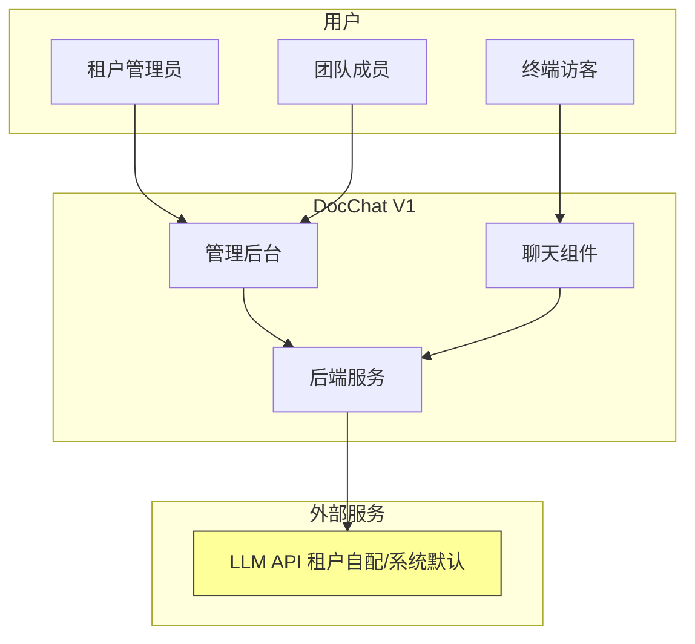
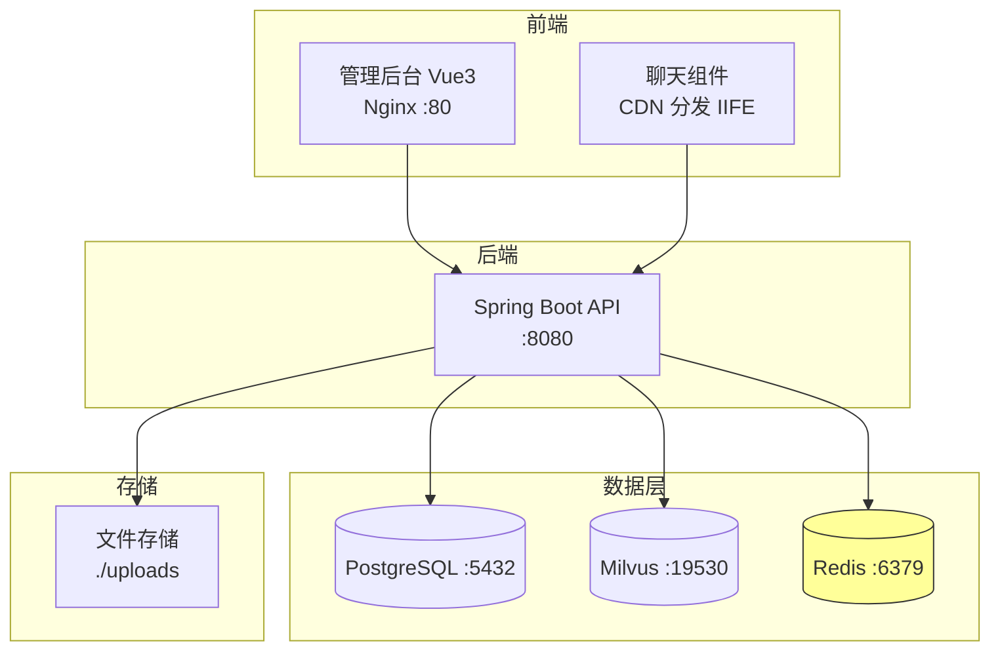
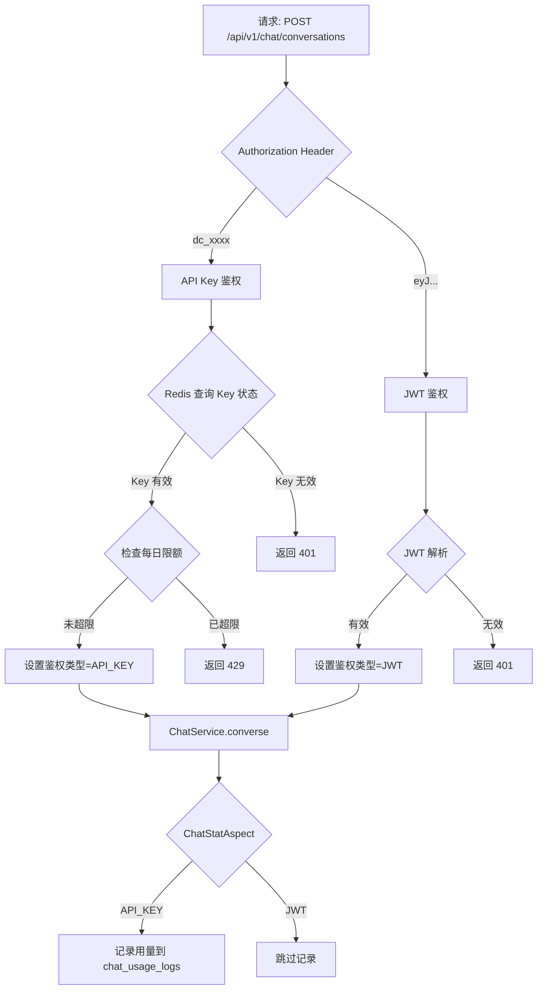
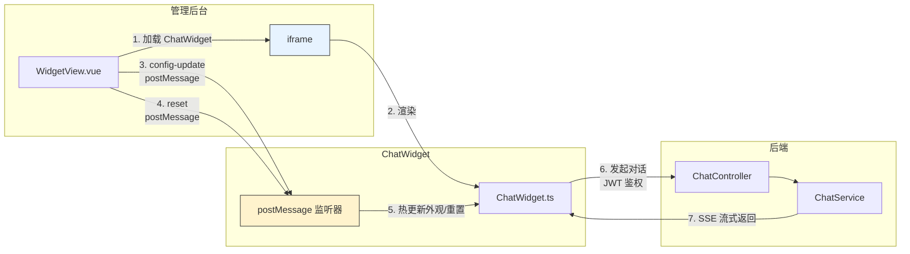

# 架构图

> 项目：DocChat — 文档智能客服 SaaS
> 版本：V1
> 日期：2026-06-26

## 1. 系统上下文图（V1 增量）



## 2. 容器图



## 3. V1 模块组件图

```mermaid
graph TB
    subgraph module-apikey "🔑 API Key 模块 (V1)"
        AKC[ApiKeyController]
        AKS[ApiKeyService]
        AKR[ApiKeyRepository]
        AKE[ApiKey Entity]
    end

    subgraph module-stat "📊 统计模块 (V1)"
        STC[StatController]
        STS[StatService]
        STR[StatRepository]
        STE[ChatUsageLog Entity]
    end

    subgraph module-eval "📝 评测模块 (V1)"
        EVC[EvalController]
        EVS[EvalService]
        EVR[EvalRepository]
        EVE[EvalSet / EvalPair / EvalResult Entity]
    end

    subgraph module-chat "对话模块 (V1 变更)"
        CHC[ChatController<br/>JWT + API Key 双鉴权]
        CHS[ChatService]
        CSAP[ChatStatAspect<br/>AOP 用量采集]
        LLM_S[LlmService<br/>租户级 LLM 配置]
    end

    subgraph module-widget "组件模块 (V1 变更)"
        WGC[WidgetController]
        WGS[WidgetService<br/>嵌入代码用 API Key]
    end

    subgraph chat-widget "聊天组件 (V1 变更)"
        CWI[ChatWidget<br/>postMessage + reset]
    end

    AKC --> AKS --> AKR --> AKE
    STC --> STS --> STR --> STE
    EVC --> EVS --> EVR --> EVE
    CHC --> CHS
    CSAP -.->|AOP 拦截| CHS
    CHS --> LLM_S

    WGC --> WGS

    CHS -.->|鉴权| AKS
    CSAP -.->|写入| STS
    EVS -.->|检索| module-knowledge

    style module-apikey fill:#fff3cd,stroke:#856404
    style module-stat fill:#d4edda,stroke:#155724
    style module-eval fill:#cce5ff,stroke:#004085
    style CSAP fill:#f8d7da,stroke:#721c24
    style LLM_S fill:#f8d7da,stroke:#721c24
```

## 4. V1 鉴权流程图



## 5. V1 预览对话架构



## 架构说明

### V1 新增模块

1. **module-apikey**：独立模块，被 module-chat 依赖（鉴权校验）。提供 API Key 的完整生命周期管理 + 每日调用限额（Redis 计数器）
2. **module-stat**：独立模块，通过 AOP（ChatStatAspect）与 module-chat 解耦。用量数据异步写入，统计查询按日聚合
3. **module-eval**：独立模块，依赖 module-knowledge（检索能力）和 module-task（异步执行框架）

### V1 变更模块

4. **module-chat**：核心变更是"双鉴权 + 统计采集 + LLM 租户配置"。ChatController 根据 token 前缀判断鉴权方式；ChatStatAspect 通过 AOP 拦截决定是否记录用量；LlmService 查租户配置表 fallback 到系统默认
5. **module-widget**：嵌入代码生成使用 API Key 替代 widget_token
6. **ChatWidget**：新增 postMessage 监听器支持管理后台的实时预览交互

### 关键设计决策

- **AOP 解耦统计**：ChatStatAspect 不修改 ChatService 任何代码，零侵入地实现用量采集
- **Redis 计数器做限额**：利用 Redis INCR + EXPIRE 实现高性能的每日调用计数，无需额外中间件
- **评测复用任务框架**：评测执行复用 module-task 的 Redis 队列 + Worker 机制，不重复造轮子
