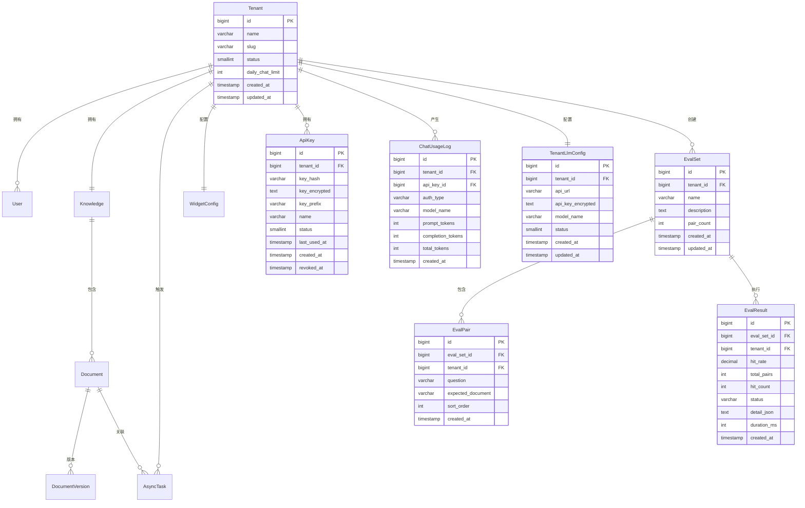

# 数据模型设计

> 项目：DocChat — 文档智能客服 SaaS
> 版本：V1
> 日期：2026-06-26
> 基线：基于 MVP 数据模型增量扩展

## 1. ER 关系图（V1 新增部分高亮）



## 2. 表结构定义

### 2.1 api_keys — API Key 表 (V1 新增)

| 列名 | 类型 | 约束 | 默认值 | 描述 |
|------|------|------|--------|------|
| id | BIGINT | PK, AUTO_INCREMENT | | 主键 |
| tenant_id | BIGINT | NOT NULL, FK → tenants(id) | | 所属租户 |
| key_hash | VARCHAR(64) | NOT NULL, UNIQUE | | SHA-256 哈希（用于快速查找） |
| key_encrypted | TEXT | NOT NULL | | AES-256 加密的完整 Key |
| key_prefix | VARCHAR(10) | NOT NULL | | Key 前缀（如 `dc_a1b2`），用于展示 |
| name | VARCHAR(50) | | | Key 名称（管理员自定义） |
| status | SMALLINT | NOT NULL | 1 | 状态：1-有效 0-已吊销 |
| last_used_at | TIMESTAMP | | | 最后使用时间 |
| created_at | TIMESTAMP | NOT NULL | CURRENT_TIMESTAMP | 创建时间 |
| revoked_at | TIMESTAMP | | | 吊销时间 |

**业务约束**：每个租户最多 5 个有效 Key（应用层校验）。

### 2.2 chat_usage_logs — 对话用量日志表 (V1 新增)

| 列名 | 类型 | 约束 | 默认值 | 描述 |
|------|------|------|--------|------|
| id | BIGINT | PK, AUTO_INCREMENT | | 主键 |
| tenant_id | BIGINT | NOT NULL, FK → tenants(id) | | 所属租户 |
| api_key_id | BIGINT | FK → api_keys(id) | | 使用的 API Key（预览对话为空） |
| auth_type | VARCHAR(10) | NOT NULL | | 鉴权类型：API_KEY / JWT |
| model_name | VARCHAR(50) | | | 使用的 LLM 模型名 |
| prompt_tokens | INT | NOT NULL | 0 | Prompt Token 数 |
| completion_tokens | INT | NOT NULL | 0 | Completion Token 数 |
| total_tokens | INT | NOT NULL | 0 | 总 Token 数 |
| created_at | TIMESTAMP | NOT NULL | CURRENT_TIMESTAMP | 创建时间 |

**说明**：
- `auth_type=JWT` 的记录为预览对话，不应计入用量统计（但保留日志用于审计）
- 实际统计时按 `auth_type=API_KEY` 过滤

### 2.3 tenant_llm_configs — 租户 LLM 配置表 (V1 新增)

| 列名 | 类型 | 约束 | 默认值 | 描述 |
|------|------|------|--------|------|
| id | BIGINT | PK, AUTO_INCREMENT | | 主键 |
| tenant_id | BIGINT | NOT NULL, FK → tenants(id), UNIQUE | | 所属租户（一租户一配置） |
| api_url | VARCHAR(500) | NOT NULL | | LLM API 端点 URL |
| api_key_encrypted | TEXT | NOT NULL | | AES-256 加密的 API Key |
| model_name | VARCHAR(50) | NOT NULL | | 模型名称 |
| status | SMALLINT | NOT NULL | 1 | 状态：1-启用 0-禁用 |
| created_at | TIMESTAMP | NOT NULL | CURRENT_TIMESTAMP | 创建时间 |
| updated_at | TIMESTAMP | NOT NULL | CURRENT_TIMESTAMP | 更新时间 |

**说明**：租户未配置时，LlmService 使用系统默认（application.yml 中的 `docchat.llm.*`）。

### 2.4 eval_sets — 评测集表 (V1 新增)

| 列名 | 类型 | 约束 | 默认值 | 描述 |
|------|------|------|--------|------|
| id | BIGINT | PK, AUTO_INCREMENT | | 主键 |
| tenant_id | BIGINT | NOT NULL, FK → tenants(id) | | 所属租户 |
| name | VARCHAR(100) | NOT NULL | | 评测集名称 |
| description | TEXT | | | 描述 |
| pair_count | INT | NOT NULL | 0 | 问答对数量（冗余计数） |
| created_at | TIMESTAMP | NOT NULL | CURRENT_TIMESTAMP | 创建时间 |
| updated_at | TIMESTAMP | NOT NULL | CURRENT_TIMESTAMP | 更新时间 |

**业务约束**：每个租户最多 10 个评测集（应用层校验）。

### 2.5 eval_pairs — 评测问答对表 (V1 新增)

| 列名 | 类型 | 约束 | 默认值 | 描述 |
|------|------|------|--------|------|
| id | BIGINT | PK, AUTO_INCREMENT | | 主键 |
| eval_set_id | BIGINT | NOT NULL, FK → eval_sets(id) | | 所属评测集 |
| tenant_id | BIGINT | NOT NULL, FK → tenants(id) | | 所属租户 |
| question | VARCHAR(500) | NOT NULL | | 问题 |
| expected_document | VARCHAR(255) | NOT NULL | | 期望命中的文档名 |
| sort_order | INT | NOT NULL | 0 | 排序序号 |
| created_at | TIMESTAMP | NOT NULL | CURRENT_TIMESTAMP | 创建时间 |

**业务约束**：每个评测集最多 50 个问答对（应用层校验）。

### 2.6 eval_results — 评测结果表 (V1 新增)

| 列名 | 类型 | 约束 | 默认值 | 描述 |
|------|------|------|--------|------|
| id | BIGINT | PK, AUTO_INCREMENT | | 主键 |
| eval_set_id | BIGINT | NOT NULL, FK → eval_sets(id) | | 所属评测集 |
| tenant_id | BIGINT | NOT NULL, FK → tenants(id) | | 所属租户 |
| hit_rate | DECIMAL(5,2) | NOT NULL | | 命中率百分比（0.00-100.00） |
| total_pairs | INT | NOT NULL | | 总问答对数 |
| hit_count | INT | NOT NULL | | 命中数 |
| status | VARCHAR(20) | NOT NULL | 'COMPLETED' | 状态：RUNNING/COMPLETED/FAILED |
| detail_json | JSONB | | | 详细结果 JSON（每个问答对的检索结果） |
| duration_ms | INT | NOT NULL | 0 | 执行耗时（毫秒） |
| created_at | TIMESTAMP | NOT NULL | CURRENT_TIMESTAMP | 创建时间 |

### 2.7 tenants 表变更 (V1 ALTER)

新增列：

| 列名 | 类型 | 约束 | 默认值 | 描述 |
|------|------|------|--------|------|
| daily_chat_limit | INT | NOT NULL | 1000 | 每日对话调用限额 |

## 3. 索引设计

### 3.1 V1 新增索引

| 表名 | 索引名 | 列 | 类型 | 用途 |
|------|--------|-----|------|------|
| api_keys | uk_ak_key_hash | key_hash | UNIQUE | 按 Key 哈希快速查找 |
| api_keys | idx_ak_tenant_id | tenant_id | NORMAL | 租户维度的 Key 查询 |
| api_keys | idx_ak_tenant_status | (tenant_id, status) | NORMAL | 租户有效 Key 查询 |
| chat_usage_logs | idx_cul_tenant_created | (tenant_id, created_at) | NORMAL | 租户按日期范围统计 |
| chat_usage_logs | idx_cul_tenant_auth_created | (tenant_id, auth_type, created_at) | NORMAL | 按鉴权类型统计 |
| chat_usage_logs | idx_cul_api_key_id | api_key_id | NORMAL | 按 API Key 统计 |
| tenant_llm_configs | uk_tlc_tenant_id | tenant_id | UNIQUE | 租户唯一 LLM 配置 |
| eval_sets | idx_es_tenant_id | tenant_id | NORMAL | 租户维度的评测集查询 |
| eval_pairs | idx_ep_eval_set_id | eval_set_id | NORMAL | 评测集的问答对查询 |
| eval_pairs | idx_ep_tenant_id | tenant_id | NORMAL | 租户隔离查询 |
| eval_results | idx_er_eval_set_id | eval_set_id | NORMAL | 评测集的结果查询 |
| eval_results | idx_er_tenant_created | (tenant_id, created_at) | NORMAL | 租户按时间查看结果 |

## 4. Milvus Collection 设计

（继承 MVP，无变更）每个租户一个独立 Collection：`docchat_vectors_{tenant_id}`

## 5. Redis 数据结构设计（V1 新增）

| Key 模式 | 类型 | 用途 | TTL |
|----------|------|------|-----|
| `docchat:quota:{tenant_id}:{yyyyMMdd}` | STRING (INT) | 每日调用计数器 | 到次日 UTC 零点 |
| `docchat:apikey:cache:{key_hash}` | STRING (JSON) | API Key 验证结果缓存 | 5min |
| `docchat:eval:running:{eval_set_id}` | STRING | 评测执行锁（防重复执行） | 10min |

**每日限额计数器逻辑**：
```
INCR docchat:quota:{tenant_id}:{yyyyMMdd}
EXPIRE docchat:quota:{tenant_id}:{yyyyMMdd} {seconds_to_next_midnight_utc}
GET docchat:quota:{tenant_id}:{yyyyMMdd} → 检查是否超限
```

## 6. 数据迁移策略

### 6.1 Flyway 迁移脚本

| 脚本 | 内容 |
|------|------|
| V5__add_v1_tables.sql | 创建 api_keys、chat_usage_logs、tenant_llm_configs、eval_sets、eval_pairs、eval_results 表 |
| V6__alter_tenant_add_daily_limit.sql | tenants 表新增 daily_chat_limit 列，默认值 1000 |
| V7__add_v1_indexes.sql | 创建 V1 新增索引 |

### 6.2 兼容性说明

- V5~V7 为纯增量操作（CREATE TABLE / ALTER TABLE ADD COLUMN / CREATE INDEX），不影响 MVP 已有数据
- widget_configs 表保留 widget_token 列，V1 过渡期双鉴权并存
- V1 迁移后，tenants 表新增 daily_chat_limit 列，默认 1000，无需回填历史数据

## 7. 变更记录

| 日期 | 变更内容 |
|------|---------|
| 2026-06-26 | V1 初始版本：6 张新增表 + 1 张变更表 + Redis 新增 3 个 Key 模式 |
