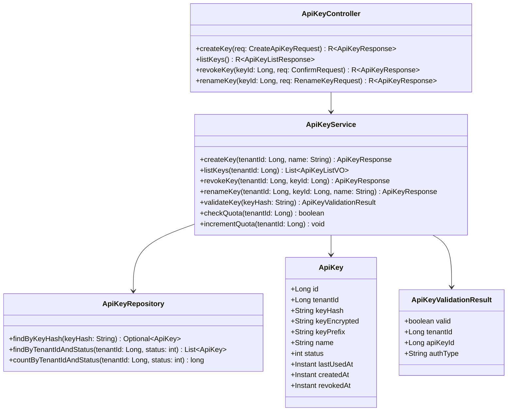
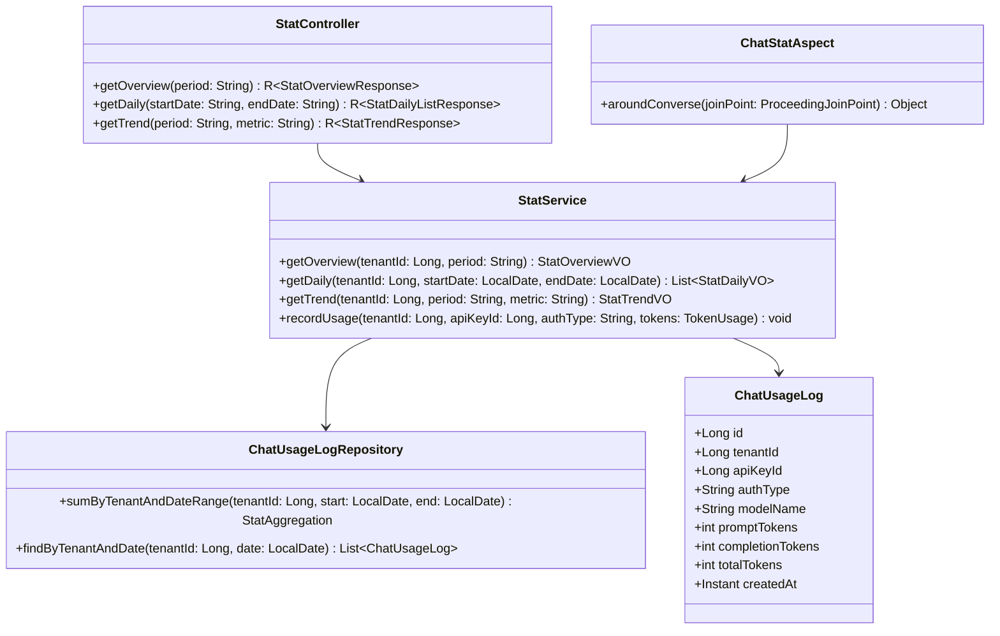
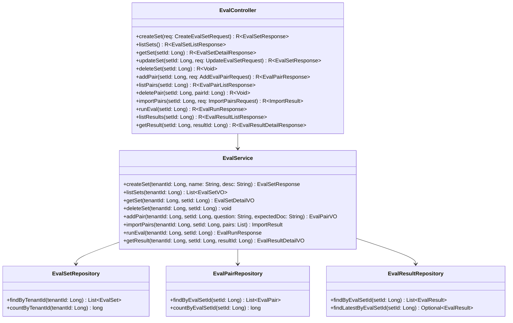
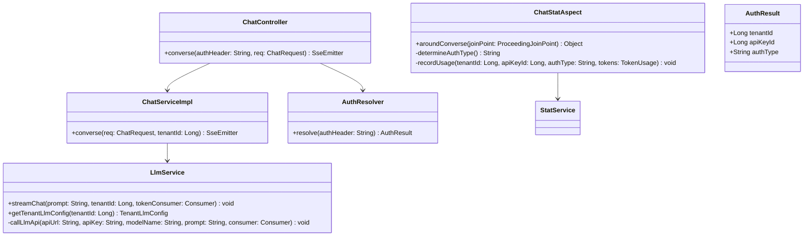
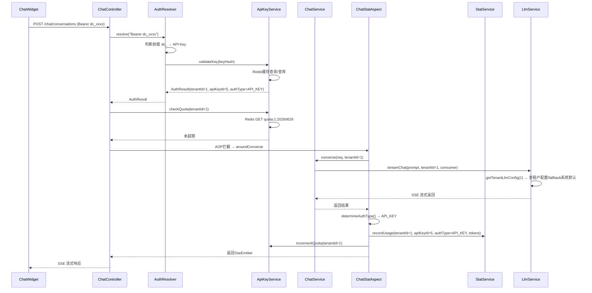
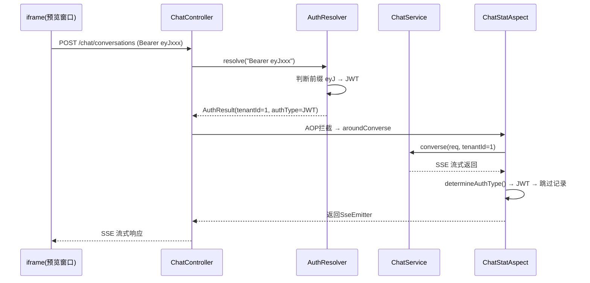
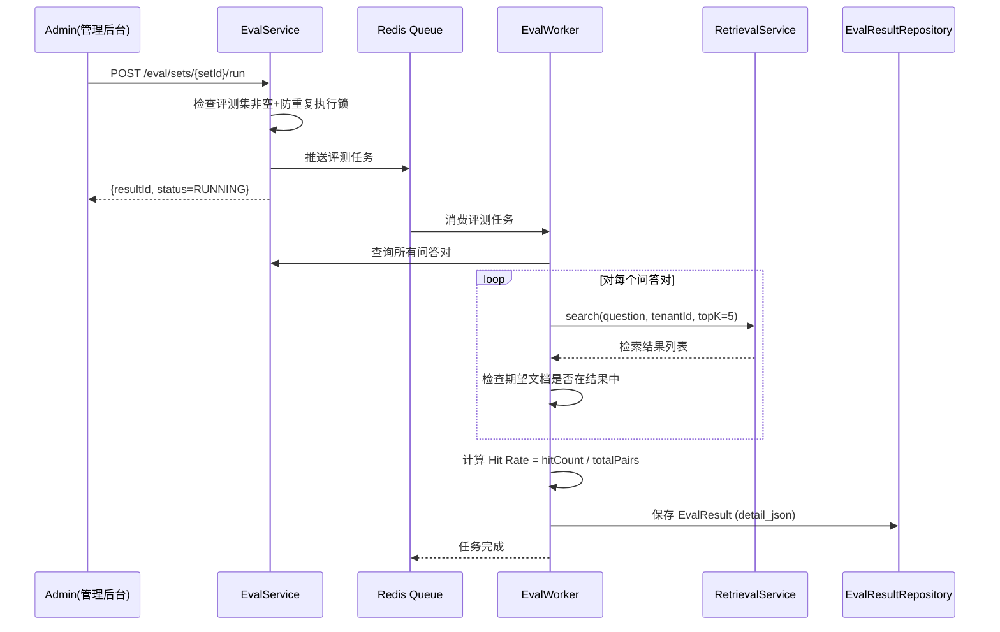
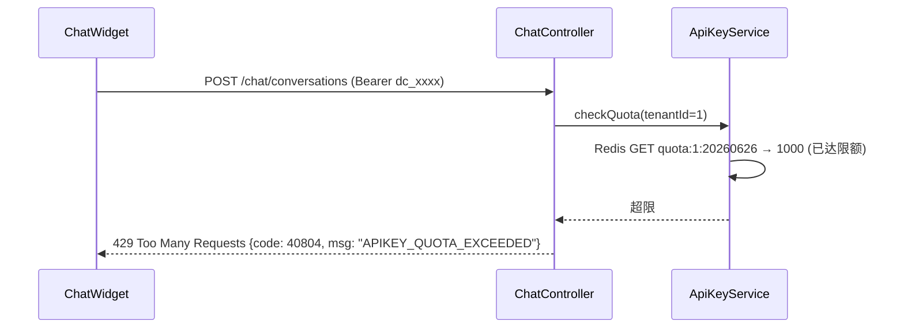
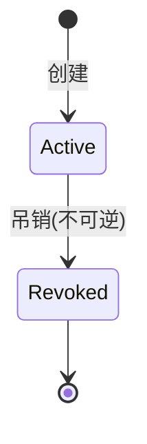
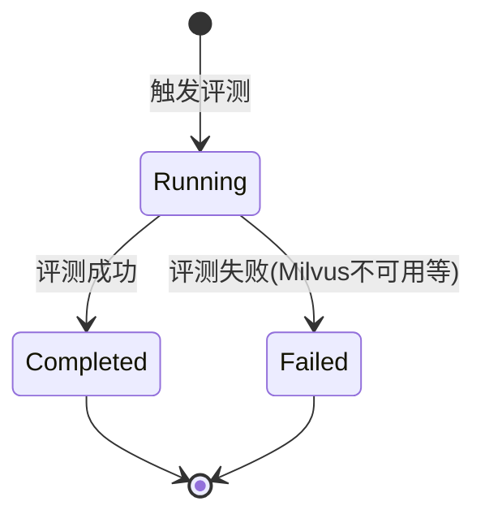

# 详细设计文档

> 项目：DocChat — 文档智能客服 SaaS
> 版本：V1
> 日期：2026-06-26

## 1. 模块概述

V1 在 MVP 基础上新增 3 个后端模块、变更 2 个后端模块、变更前端和聊天组件。各模块职责：

| 模块 | 职责 | 新增/变更 |
|------|------|----------|
| module-apikey | API Key 生成/吊销/限额/鉴权 | 新增 |
| module-stat | 用量采集(AOP)+统计查询+面板数据 | 新增 |
| module-eval | 评测集CRUD+评测执行(异步)+结果存储 | 新增 |
| module-chat | 双鉴权+统计切面+LLM租户配置 | 变更 |
| module-widget | 嵌入代码使用API Key | 变更 |
| web (前端) | 新增3个管理页面+Widget预览iframe | 变更 |
| chat-widget | postMessage监听+API Key鉴权+reset() | 变更 |

## 2. 类图

### 2.1 module-apikey

### 2.2 module-stat

### 2.3 module-eval

### 2.4 module-chat 变更

## 3. 时序图

### 3.1 API Key 鉴权对话流程

### 3.2 JWT 预览对话流程

### 3.3 评测执行流程

### 3.4 超限拒绝流程

## 4. 状态机

### 4.1 API Key 状态

### 4.2 评测结果状态

## 5. 关键算法

### 5.1 API Key 生成算法

**输入**：租户ID + 可选名称

**输出**：ApiKey 实体（含 keyHash、keyEncrypted、keyPrefix）

**算法步骤**：

1. 检查租户有效 Key 数量 ≤ 5
2. 生成随机 Key：`dc_` + 32位随机hex字符（`SecureRandom`）
3. 计算 keyHash = SHA-256(key) → 用于快速查找
4. 计算 keyEncrypted = AES-256-Encrypt(key, secretKey) → 用于存储原文
5. 计算 keyPrefix = key.substring(0, 7) → 用于脱敏展示
6. 保存到 api_keys 表
7. 返回完整 key（仅此一次）

### 5.2 每日限额计数算法

**输入**：tenantId

**输出**：是否超限

**算法步骤**：

1. 构造 Redis Key：`docchat:quota:{tenantId}:{yyyyMMdd}`
2. Redis INCR key → 获取当前计数
3. 如果 key 不存在（首次），设置 EXPIRE 到次日 UTC 零点
4. 比较计数与 `tenants.daily_chat_limit`
5. 超限 → 返回 false，未超限 → 返回 true

**复杂度**：O(1)（Redis INCR 原子操作）

### 5.3 评测 Hit Rate 计算算法

**输入**：评测集 ID + 租户 ID

**输出**：Hit Rate 百分比

**算法步骤**：

1. 查询评测集所有问答对
2. 对每个问答对：
   a. 使用 RetrievalService.search(question, tenantId, topK=5)
   b. 检查期望文档名是否出现在 Top-K 结果中
   c. 记录 hit=true/false + 实际检索结果列表
3. hitCount = 命中的问答对数
4. hitRate = hitCount / totalPairs × 100
5. 将结果保存到 eval_results 表（detail_json 为 JSONB）

**复杂度**：O(N) × 向量检索复杂度，N 为问答对数量

## 6. 错误处理策略

| 异常场景 | 错误码 | 处理方式 |
|----------|--------|---------|
| API Key 无效/已吊销 | APIKEY_INVALID (40802) | 返回 401，提示 Key 无效 |
| API Key 超限 | APIKEY_QUOTA_EXCEEDED (40804) | 返回 429，提示超限 |
| Key 数量超限 | APIKEY_LIMIT_EXCEEDED (40803) | 返回 400，提示最多 5 个 |
| 评测集超限 | EVAL_SET_LIMIT_EXCEEDED (41002) | 返回 400，提示最多 10 个 |
| 问答对超限 | EVAL_PAIR_LIMIT_EXCEEDED (41003) | 返回 400，提示最多 50 对 |
| 评测重复执行 | EVAL_ALREADY_RUNNING (41004) | 返回 409，提示正在执行 |
| LLM 连通失败 | LLM_CONFIG_TEST_FAILED (41102) | 返回 503，提示连通失败 |
| LLM 配置 URL 不合法 | LLM_CONFIG_URL_INVALID (41101) | 返回 400，提示 URL 不合法 |

## 7. 变更记录

| 日期 | 变更内容 |
|------|---------|
| 2026-06-26 | V1 初始版本，定义 7 模块类图 + 4 个时序图 + 2 个状态机 + 3 个算法 |
