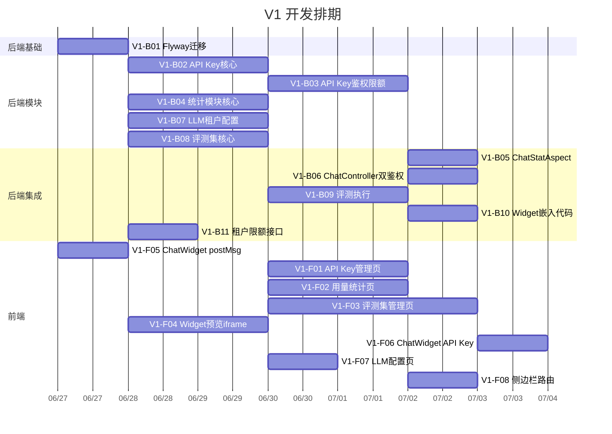

# 任务拆分与排期

> 项目：DocChat — 文档智能客服 SaaS
> 版本：V1
> 日期：2026-06-26

## 1. 任务列表

### 后端任务

| 任务ID | 任务名称 | 描述 | 预估工时 | 依赖 | 优先级 |
|--------|---------|------|---------|------|--------|
| V1-B01 | Flyway迁移脚本V5-V7 | 创建V1新增表+索引+ALTER tenants | 0.5天 | 无 | P0 |
| V1-B02 | module-apikey 核心 | ApiKey实体+Repository+Service(Controller/CRUD+生成/吊销/重命名) | 2天 | V1-B01 | P0 |
| V1-B03 | module-apikey 鉴权+限额 | AuthResolver+Redis限额计数器+validateKey+checkQuota | 1.5天 | V1-B02 | P0 |
| V1-B04 | module-stat 核心 | ChatUsageLog实体+Repository+StatService(采集+查询+聚合) | 1.5天 | V1-B01 | P0 |
| V1-B05 | ChatStatAspect | AOP切面拦截ChatService.converse()+判断鉴权类型+异步记录用量 | 1天 | V1-B03, V1-B04 | P0 |
| V1-B06 | ChatController双鉴权 | AuthResolver集成+API Key鉴权路径+JWT鉴权路径+超限429 | 1天 | V1-B03 | P0 |
| V1-B07 | LlmService租户配置 | TenantLlmConfig实体+Repository+getTenantLlmConfig()+fallback+连通测试 | 1.5天 | V1-B01 | P1 |
| V1-B08 | module-eval 核心 | EvalSet/EvalPair/EvalResult实体+Repository+CRUD Service | 2天 | V1-B01 | P0 |
| V1-B09 | module-eval 评测执行 | EvalWorker(异步)+HitRate计算+结果存储 | 1.5天 | V1-B08 | P0 |
| V1-B10 | Widget嵌入代码更新 | WidgetService生成嵌入代码使用API Key+向后兼容 | 0.5天 | V1-B03 | P1 |
| V1-B11 | 租户限额配置接口 | PATCH /tenants/current/daily-limit | 0.5天 | V1-B01 | P1 |

### 前端任务

| 任务ID | 任务名称 | 描述 | 预估工时 | 依赖 | 优先级 |
|--------|---------|------|---------|------|--------|
| V1-F01 | API Key管理页 | Key列表+创建弹窗(仅展示一次)+吊销确认+重命名 | 1.5天 | V1-B02 | P0 |
| V1-F02 | 用量统计页 | 概览卡片+趋势图(echarts)+每日明细表+日期筛选 | 2天 | V1-B04 | P0 |
| V1-F03 | 评测集管理页 | 评测集列表+详情(问答对表格)+添加/删除/批量导入+执行评测+结果展示 | 2.5天 | V1-B08 | P0 |
| V1-F04 | Widget预览iframe | WidgetView增加iframe+postMessage通信+模拟对话+刷新重置按钮 | 1.5天 | V1-F05 | P1 |
| V1-F05 | ChatWidget postMessage | ChatWidget新增postMessage监听器+reset()+config-update处理 | 1天 | 无 | P1 |
| V1-F06 | ChatWidget API Key鉴权 | 替换widget_token为API Key | 0.5天 | V1-B10, V1-F05 | P1 |
| V1-F07 | LLM配置页面 | LLM配置表单+连通性测试+密钥脱敏展示 | 1天 | V1-B07 | P1 |
| V1-F08 | 侧边栏+路由更新 | 新增3个导航菜单+路由配置+API接口封装 | 0.5天 | V1-F01, V1-F02, V1-F03 | P0 |

## 2. 依赖关系图

## 3. 里程碑

| 里程碑 | 包含任务 | 预计完成日期 | 验收标准 |
|--------|---------|-------------|----------|
| M1: 后端核心完成 | V1-B01~B04, B07, B08 | 第4天 | 后端3个新模块API可调通 |
| M2: 后端集成完成 | V1-B05, B06, B09~B11 | 第6天 | 双鉴权+统计采集+评测执行全部可用 |
| M3: 前端页面完成 | V1-F01~F04, F07, F08 | 第8天 | 3个新管理页面+Widget预览可用 |
| M4: 全部完成 | V1-F05, F06 | 第9天 | ChatWidget postMessage+API Key鉴权 |

## 4. 工时汇总

| 类别 | 任务数 | 总工时 |
|------|--------|--------|
| 后端 | 11 | 12天 |
| 前端 | 8 | 10.5天 |
| **合计** | **19** | **22.5天** |

**说明**：前后端可并行开发，关键路径为后端模块 → 前端页面，实际日历天数约 9 天。

## 5. 变更记录

| 日期 | 变更内容 |
|------|---------|
| 2026-06-26 | V1 初始版本，19个任务，预估22.5天工时，关键路径约9天 |
