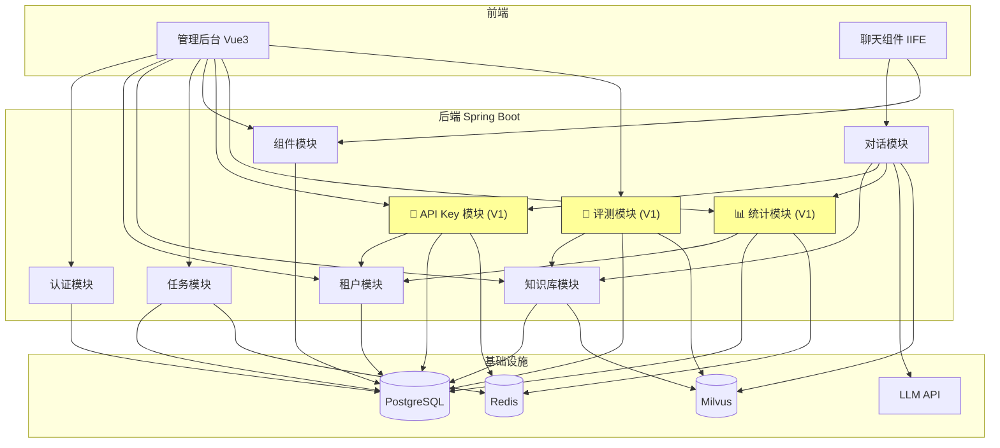

# 技术方案文档

> 项目：DocChat — 文档智能客服 SaaS
> 版本：2.0 (V1)
> 日期：2026-06-26
> 作者：技术团队
> 基线：基于 MVP 技术方案增量迭代

## 1. 概述

### 1.1 文档目的

本文档定义 V1 阶段的技术方案，覆盖 API Key 管理、用量统计、评测集、聊天组件预览与模拟测试、LLM API 配置 5 大功能模块的技术实现方案。

### 1.2 项目背景

MVP 阶段已完成核心功能闭环（P0 全部交付），V1 在此基础上新增 P1 功能，提升产品的商用能力：访问控制、用量管理、质量评测、预览测试、真实 LLM 接入。

### 1.3 术语和缩写

| 术语 | 定义 |
|------|------|
| API Key | `dc_` 前缀的租户访问密钥，用于聊天组件鉴权 |
| Hit Rate | 检索命中率 = 命中期望文档的问答对数 / 总问答对数 |
| ChatStatAspect | 对话统计切面，AOP 拦截对话方法采集用量数据 |
| 同路径原则 | 预览对话与正式对话走完全相同的后端代码路径 |

## 2. 架构设计

### 2.1 系统架构（V1 增量部分高亮）

### 2.2 架构说明

**V1 新增 3 个模块**，遵循 MVP 已有的分层架构（Controller → Service → Repository → Entity）：

1. **module-apikey**：API Key 的 CRUD + 每日调用计数（Redis） + 鉴权拦截
2. **module-stat**：用量数据采集（AOP）+ 聚合查询 + 统计面板数据接口
3. **module-eval**：评测集 CRUD + 评测执行（异步）+ 结果存储与对比

**V1 变更 2 个现有模块**：

4. **module-chat**：ChatController 新增 JWT 鉴权支持（预览对话）；LlmService 支持租户级 LLM 配置；新增 ChatStatAspect（AOP 切面）
5. **module-widget**：WidgetService 生成嵌入代码时使用 API Key 替代 widget_token

**V1 变更前端**：

6. **web/**：新增 API Key 管理页、用量统计页、评测集管理页；WidgetView 新增 iframe 预览窗口

**V1 变更聊天组件**：

7. **chat-widget/**：ChatWidget 新增 postMessage 监听器（接收 config-update 和 reset 消息）；鉴权从 widget_token 改为 API Key

### 2.3 部署架构

（继承 MVP，无变更）Docker Compose 单实例部署。

## 3. 技术选型

V1 不引入新技术栈，全部使用 MVP 已有技术选型。新增功能通过现有技术实现：

| 功能 | 实现方式 | 说明 |
|------|---------|------|
| API Key 加密存储 | AES-256 + 配置密钥 | 密钥通过环境变量注入 |
| 每日调用计数 | Redis INCR + EXPIRE | Key: `docchat:quota:{tenant_id}:{date}`，TTL 到次日零点 |
| 用量数据采集 | Spring AOP @Around | ChatStatAspect 拦截 ChatService.converse() |
| 统计数据聚合 | PostgreSQL 按日聚合 | chat_usage_logs 表 + SQL 聚合查询 |
| 评测执行 | 异步（Redis 队列 + Worker） | 复用 module-task 的异步任务框架 |
| 预览窗口 | iframe + postMessage | 管理后台 iframe 嵌入真实 ChatWidget |
| LLM 租户配置 | tenant_llm_configs 表 | LlmService 优先查租户配置，fallback 系统默认 |

## 4. 数据模型设计

详见：[数据模型设计](docchat-data-model.md)

## 5. 接口设计

详见：[API 接口设计](docchat-api-design.md)

## 6. 安全设计

### 6.1 认证方案（V1 变更）

**双鉴权模式**：ChatController 的 `/api/v1/chat/conversations` 端点同时支持两种鉴权：

| 鉴权方式 | Header 格式 | 适用场景 | 用量统计 |
|---------|------------|---------|---------|
| API Key | `Authorization: Bearer dc_xxxx` | 正式访客对话 | ✅ 计入 |
| JWT Token | `Authorization: Bearer eyJ...` | 预览对话（管理员） | ❌ 不计入 |

**鉴权解析流程**：
1. 读取 Authorization header
2. 判断 token 前缀：`dc_` → API Key 鉴权，`eyJ` → JWT 鉴权
3. API Key 鉴权：查 api_keys 表验证 Key 有效性和每日限额
4. JWT 鉴权：解析 JWT 获取用户和租户信息
5. 将鉴权类型写入 SecurityContext / RequestScope 供 ChatStatAspect 使用

### 6.2 授权方案

（继承 MVP，无变更）

### 6.3 数据安全

| 数据 | 加密方式 | 存储方式 | 展示方式 |
|------|---------|---------|---------|
| API Key 原文 | AES-256 加密 | api_keys.key_encrypted | 仅生成时展示一次，之后脱敏 `dc_****xxxx` |
| LLM API Key | AES-256 加密 | tenant_llm_configs.api_key_encrypted | 脱敏 `sk-****xxxx` |
| API Key 哈希 | SHA-256 | api_keys.key_hash | 用于快速查找（避免解密） |

### 6.4 输入安全

（继承 MVP）+ 新增：
- API Key 格式校验：必须 `dc_` 前缀 + 32 位随机字符
- 评测集问答对长度限制：问题 ≤ 500 字符，期望文档名 ≤ 255 字符
- LLM API URL 格式校验：必须是合法 HTTPS URL

### 6.5 通信安全

（继承 MVP）+ 新增：
- **postMessage 安全校验**：ChatWidget 的 postMessage 监听器校验 `event.origin`，只接受管理后台域名

## 7. 性能设计

### 7.1 性能目标

| 指标 | 目标值 | 测量方式 |
|------|--------|---------|
| 对话 API P95 | < 2s | 压测 |
| 管理后台 API P95 | < 500ms | 压测 |
| API Key 鉴权开销 | < 5ms | Redis 查询 + 缓存 |
| 用量统计查询 | < 200ms | 30 天聚合 |
| 评测执行（50 对） | < 30s | 异步执行 |

### 7.2 性能策略

- **API Key 缓存**：Redis 缓存 API Key 验证结果，TTL 5min，避免每次请求查库
- **用量统计异步写入**：ChatStatAspect 采集数据后异步写入，不阻塞对话响应
- **统计查询优化**：chat_usage_logs 按日期分区，聚合查询走索引
- **评测异步执行**：评测任务走 Redis 队列异步执行，不阻塞管理后台

## 8. 可观测性设计

### 8.1 日志策略

（继承 MVP）+ 新增关键日志点：
- API Key 生成/吊销操作
- 每日调用限额触发（WARN 级别）
- 评测执行开始/完成/失败
- LLM API 配置变更
- 预览对话发起（DEBUG 级别，标注 preview=true）

### 8.2 监控指标

| 指标 | 告警阈值 | 处理方案 |
|------|---------|---------|
| API Key 鉴权失败率 | > 10% | 检查是否有 Key 泄露 |
| 每日调用限额触发次数 | > 100/天 | 通知租户升级限额 |
| 评测执行失败率 | > 20% | 检查 Milvus 可用性 |
| LLM API 调用失败率 | > 5% | 检查 LLM 服务可用性 |

## 9. 风险与应对

| 风险 | 影响 | 可能性 | 应对方案 |
|------|------|--------|---------|
| API Key 泄露导致滥用 | 高 | 中 | 支持即时吊销 + 每日限额兜底 + 异常调用告警 |
| 用量统计数据量增长 | 中 | 高 | 按日聚合 + 定期归档历史数据 + 索引优化 |
| 评测执行影响在线对话性能 | 中 | 低 | 评测走异步队列，与对话请求隔离 |
| LLM API 不可用 | 高 | 中 | fallback 到系统默认 LLM + 熔断机制 |
| widget_token → API Key 迁移 | 中 | 中 | 保持 widget_token 向后兼容过渡期，双鉴权并存 |

## 10. 变更记录

| 日期 | 版本 | 变更内容 |
|------|------|---------|
| 2026-06-26 | 2.0 | V1 技术方案初始版本 |
